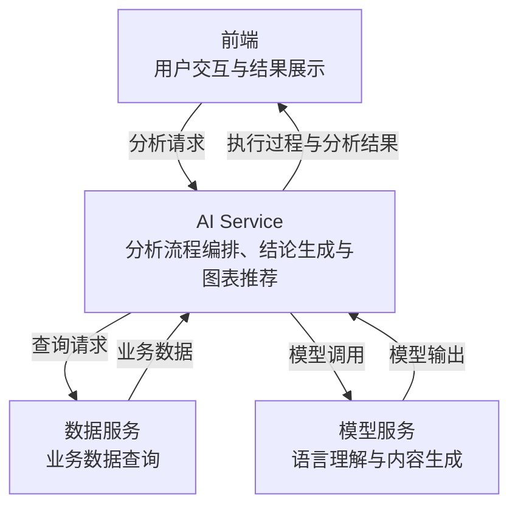

# 系统级架构说明（System Architecture Document）

## 一、系统概述(System Overview)

寿险经营分析助手采用模板驱动的固定工作流，分为前端、AI Service 和数据服务，并依赖模型服务与模板存储。模板规定分析内容和步骤，LangGraph 编排执行，LLM 负责场景匹配、内容生成和图表建议。

功能需求见 [PRODUCT.md](PRODUCT.md)，模块职责与实现见 [代码包导航](../src/life_insurance_business_analysis_assistant/README.md)。

## 二、系统分层架构(Layer Diagram)

| 组成 | 职责与边界 |
| --- | --- |
| 前端 | 基于 Agent Chat UI二次开发，负责输入、确认、模板选择、过程与结果展示及文件导出 |
| AI Service | 基于 Python 和 LangGraph，负责意图识别、模板加载、分析编排、结论生成和图表推荐；通过 Agent Server 对外服务 |
| 数据服务 | 按统一查询契约提供数据；当前为模拟服务，后续通过适配器接入真实服务，分析流程不直接访问业务数据库 |
| 模型服务 | 提供语言理解和内容生成能力；当前模拟数据服务也调用模型生成数据 |
| 模板存储 | 使用 YAML 保存场景、报告结构和分析规则；模板管理独立于分析执行 |

前端通过 LangGraph SDK 与 Agent Server 交互，可直接连接或经过代理。模型、查询能力和模板来源由服务端配置，业务流程通过明确边界使用这些依赖。

## 三、关键设计(Key Design Decisions)

当前使用模拟取数服务，详情见[data_service](../src/life_insurance_business_analysis_assistant/data_service/README.md)

无指标步骤不发起查询，使用允许范围内已完成步骤的结论及其引用数据。数据集保留原取数步骤和请求快照，综合步骤只记录引用；共用校验在生成、总结、图表和报告组装边界检查引用范围。图表按数据集去重，保留原取数步骤及章节归属。

模型内部推理不属于前端输出契约。AI Service 仅发布执行进度、结论正文和校验后的结构化结果，模型调用屏蔽原生消息流，业务流和最终消息不携带推理字段。
