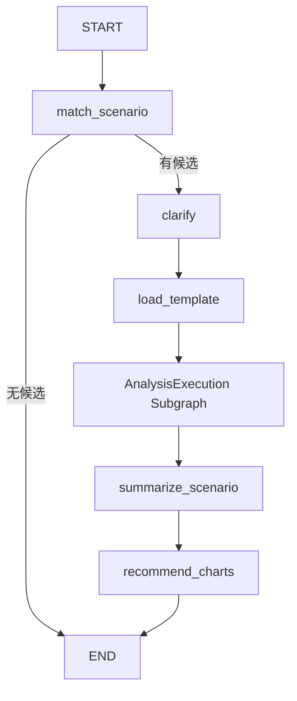
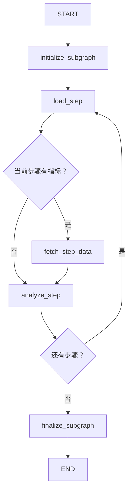

# AnalysisExecution Subgraph 重构说明

分析步骤循环已封装为独立 LangGraph 子图。输入只有已校验模板，正常输出只有 `analysis_result`；主图不再维护步骤游标、当前步骤或内部数据容器。场景匹配、用户确认、模板校验、总结和图表仍属于主图。

## 执行流程

主图保留原有 `clarify` 名称与 interrupt 交互，它对应需求中的 `select_scenario`：



聊天入口另外保留 `prepare_chat`、`present_clarification`、`no_match` 和 `present_charts` 展示节点。



两个菱形是 conditional edges，不是节点。初始化清空内部执行状态；`load_step` 校验索引、步骤编号、文本和指标。取数复用原请求构造、响应校验及 `step:{step_id}:table:{index}` 编号规则；成功后只提交 datasets。分析成功后一次提交 StepResult 和递增游标。finalize 校验完成数量、结果顺序、非空结论以及数据引用存在且属于对应步骤，是唯一正常出口。

## 最终 State Contract

共享的 `ScenarioStep`、`ScenarioTemplate`、`DatasetRecord` 原定义移到 `agent/contracts.py`，避免父子 State 循环导入。以下定义位于 `agent/subgraphs/analysis_execution/state.py`：

```python
class StepResult(TypedDict):
    step_id: int
    dataset_ids: list[str]
    conclusion: str

class AnalysisExecutionInput(TypedDict):
    template: ScenarioTemplate

class AnalysisExecutionState(AnalysisExecutionInput):
    step_index: int
    current_step: ScenarioStep | None
    datasets: dict[str, DatasetRecord]
    step_results: list[StepResult]

class AnalysisExecutionResult(TypedDict):
    datasets: dict[str, DatasetRecord]
    step_results: list[StepResult]

class AnalysisExecutionOutput(TypedDict):
    analysis_result: AnalysisExecutionResult
```

`StateGraph` 显式指定 input_schema/output_schema。LangGraph 为 output_schema 注册 `analysis_result` 输出 channel；内部 TypedDict 不需要因此混入额外业务字段。

父 `AgentState` 最终字段为 question、candidates、scenario_id、template、clarification、analysis_result、summary、chart_recommendations。`create_initial_state()` 将 analysis_result 初始化为 None。`ChatState` 继续在父状态上扩展 messages、analysis_id、last_question、status、execution。

## 核心文件与改动

| 文件 | 改动 |
| --- | --- |
| `agent/contracts.py`（新增） | 共享模板和 DatasetRecord 定义，内容保持原契约 |
| `agent/subgraphs/__init__.py`、`analysis_execution/__init__.py`（新增） | 子图包入口 |
| `agent/subgraphs/analysis_execution/state.py`（新增） | 五个子图/结果契约及 current_step 读取；StepResult 删除旧结论引用字段 |
| `agent/subgraphs/analysis_execution/graph.py`（新增） | 仅保留两条路由及 Graph 编排；编译子图，不创建独立 saver |
| `agent/subgraphs/analysis_execution/nodes/initialize_subgraph.py`、`load_step.py`、`finalize_subgraph.py`（新增） | 分别负责初始化、加载校验当前步骤、组装最终结果；每个节点独立一个文件 |
| `agent/subgraphs/analysis_execution/nodes/fetch_step_data.py`（迁移） | 原 `agent/nodes/fetch_step_data.py` 移入子图，读取 current_step，保留查询与幂等校验 |
| `agent/subgraphs/analysis_execution/nodes/analyze_step.py`（迁移） | 原分析节点移入子图，成功后提交结论与游标，移除聊天状态更新 |
| `agent/graph.py` | 删除内部循环节点/路由，主链改成 load_template → analysis_execution → summarize_scenario |
| `agent/state.py` | 内部执行字段替换为 analysis_result，更新初始化 |
| `agent/nodes/load_template.py` | 仅调整共享类型导入；加载和校验逻辑不变 |
| `agent/nodes/summarize_scenario.py` | 读取 analysis_result，传入 step_results 和按 dataset_id 去重的引用数据，拒绝无效引用 |
| `prompts/summarize_scenario.md` | 输入与示例更新为结论加数据，保留口径、模拟来源、冲突和事实约束 |
| `agent/nodes/recommend_charts.py` | 从 analysis_result 读取结果和数据；原数值、单位、时间维度、pie/scatter 等校验不变 |
| `agent/chat.py` | 配置元数据承载聊天标识，子图进度只发事件；完成后将业务结果投影为父图消息和执行记录 |
| `agent-chat-ui/src/components/thread/index.tsx` | 场景确认、失败重试也订阅 streamSubgraphs |
| `tests/test_analysis_execution.py`（新增） | 独立子图契约、节点顺序、校验、父图失败恢复、异步流、多轮隔离 |
| `tests/workflow_support.py` | 更新模拟模型 patch 路径，增加内部状态测试构造器 |
| `tests/test_analysis_loop.py`、`test_analyze_step.py`、`test_fetch_step_data.py`、`test_data_query.py` | 适配节点迁移和内部状态，保留多步、无指标、响应契约与失败验证 |
| `tests/test_graph.py`、`test_chat.py`、`test_workflow_integration.py` | 验证父图边界、嵌套检查点、失败事件和恢复路径 |
| `tests/test_load_template.py`、`test_summarize_scenario.py`、`test_prompt_contracts.py` | 更新父状态和总结输入契约，增加去重与引用校验 |
| `.gitignore` | 允许新增子图测试被版本控制跟踪 |
| `README.md`、本文 | 更新流程、契约、检查点使用及测试说明 |

## Chat 适配与恢复语义

普通入口直接将编译后的子图注册为 `analysis_execution`。聊天入口在同一个节点位置使用薄调用适配器：它只向子图传 template，通过 RunnableConfig.metadata 传 analysis_id/turn_id，并在子图成功返回后组装父图的 messages/execution。闭包中的编译子图仍可被 LangGraph 发现，`get_state(config, subgraphs=True)` 可查看内部状态。

原 track_execution 会在返回值里添加 execution，不能原样用于业务子图。新的 track_analysis_step 复用其事件、日志和异常逻辑，但移除执行记录更新；stream_text 从运行配置读取聊天标识。子图 State/Output 不包含 messages、analysis_id、status 或 execution。

恢复行为：

1. 子图继承父 checkpointer。普通入口仍使用 InMemorySaver，Studio 仍使用 Agent Server 提供的 saver。
2. fetch 成功与 analyze 执行属于不同 superstep；数据会先进入子图检查点。
3. analyze 失败不会保存半成品结论或推进游标；父图停在 analysis_execution，子图停在 analyze_step。
4. 同 thread_id 用 `invoke(None, config)` 恢复，LangGraph 恢复子图的失败节点；聊天调用适配器虽会重新进入，子图初始化与已完成查询不会重新执行。
5. 用户确认仍使用 `Command(resume=...)`。未改变业务异常传播或增加自动重试；Query Service 已有响应修复逻辑不变。
6. 只有 finalize 成功后父图才收到 analysis_result，并进入 summarize_scenario。

## 验证结果

本地 `.venv/Scripts/python.exe -B tests/test_*.py` 逐脚本运行：16 个离线测试脚本全部通过。包含有/无指标路由、最多 16 步循环、游标推进、结果顺序、数据引用、Query 成功后 Analyze 失败恢复、复用 saver 重建 Graph 后恢复、父子图输入输出边界、异步 custom 流及同线程连续分析。Prompt 离线契约包含 10 个示例/留出样本。

前端修改文件 ESLint：0 errors、2 条原有 react-hooks/refs warnings（未修改的第 65/70 行）。`git diff --check` 通过。测试均使用显式模拟，没有调用真实 LLM 或问数服务；未将离线契约通过等同于真实模型分析质量验证。

## 已知边界

- 重构前的平面循环检查点不兼容新节点拓扑，没有加入历史迁移器；旧进行中分析需重新开始。新拓扑的正常失败恢复已验证。
- 步骤正文、思考增量、运行/失败进度继续实时发送。父图聊天消息和完成进度在整个子图完成后才持久化；执行中刷新页面可能暂时看不到此前步骤的展示记录。已完成结论和数据仍在子图检查点，不丢失；恢复完成后会重新组装全部正文。步骤思考文本只流式展示，不进入业务结果，也不持久化到最终步骤消息。
- Query 响应返回后、检查点提交前进程退出仍可能重发请求，和原实现一样不保证外部 API exactly-once。普通入口的内存 saver 仍不提供跨进程持久化。
- 总结只传被引用的数据，每个 dataset_id 一份；没有截断单个大表或新增聚合能力，因此单表很大时仍有模型上下文容量限制。
