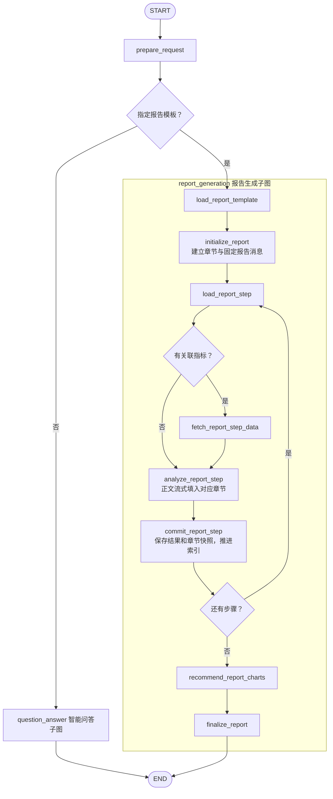

# 完整报告生成：节点定义与工作流设计

本文描述已实现的报告生成流程（当前使用 LLM 模拟取数）。模板结构以 [模板说明9.29.md](模板说明9.29.md) 为依据；当前智能问答实现见 [智能问答功能9.29.md](智能问答功能9.29.md)。

报告采用固定工作流：**加载指定模板 → 按模板逐步取数与分析 → 推荐图表 → 组装报告**。用户已经在前端选择模板，不再匹配场景或再次确认模板。当前不提取或补全必填业务参数，不因时间、范围等信息缺失而暂停追问；模拟取数服务根据收到的信息由 LLM 生成模拟数据。

全部步骤执行完成后不额外调用 LLM 总结或改写全文。只有模板明确配置了总结步骤时，才在分析循环内执行该步骤；最终报告由代码按章节顺序组装已有步骤结论、数据表和图表引用。

核心结构采用“保留章节树、展开执行步骤”的方式：章节树决定最终报告的层级与顺序，按章节顺序展开的步骤列表驱动现有分析循环。无需为每个章节动态创建 Graph 节点，也无需在每一层嵌套子图。

## 一、模板三部分的执行含义

| 模板部分 | 执行用途 |
| --- | --- |
| 报告基本信息 | 识别模板，约束渠道、时间粒度、分析对象和目的；与用户问题一起确定本次查询上下文 |
| 章节板块 | 决定报告目录、步骤顺序、关联指标和分析规则；如果存在子板块，父板块的思路传递给其所有后代步骤。如果不存在子板块，父板块的思路就是具体的执行步骤。 |
| 写作风格与格式要求 | 约束步骤结论、最终正文、表格及图表的展示；不改变原始数据和业务计算口径 |

### 章节与步骤

1. **有子板块的板块**：其分析描述作为指导信息，不独立取数，也不生成一条执行步骤。指导信息沿祖先路径逐层传递，不传给其他分支。
2. **无子板块、直接定义分析动作的板块**：转为一个执行步骤；需要查询数据时指标不能为空，明确的总结步骤按第 4 条处理。
3. **包含多个分析步骤的末级子板块**：按模板步骤顺序展开，保留每一步的指标和分析模式。需要查询数据的步骤必须有指标。
4. **只综合已有结论的步骤**：仅在模板明确要求时允许指标为空，沿用现有子图的无取数分析分支；必须明确可引用的前序步骤。不能把漏配指标的查询动作当成综合分析。

父板块的指导作用覆盖分析和写作。例如“每个主题先总体、再按阈值分类”应随子步骤传入查询和分析上下文。父级描述不能授权查询子步骤指标列表之外的指标，也不能由模型据此临时增加步骤。父子规则矛盾或模板要求的动作未被步骤覆盖时，应反馈模板问题。

本设计按用户描述，将存在子板块的父板块统一解释为指导层。若父板块同时配置了非空指标，则判为含义冲突，提示模板维护者将其独立动作移入子板块，避免静默丢弃指标或重复查询。

### 层级、标识与顺序

加载时保留完整章节树，并按数组顺序深度优先展开执行步骤；同一子板块内部按连续的步骤序号执行。编号与排列不一致时反馈模板错误，不静默重排业务顺序。

运行时生成位置路径作为 `section_id`，例如 `1`、`2`、`2.1`；每个实际步骤分配报告内唯一、从 1 开始的 `step_id`，并保留原始局部序号。章节名称允许相同，不能作为唯一标识。

当前模板的无指标步骤通过“总结 / 综合 / 综合分析”模式，或以“总结 / 汇总 / 综合分析”开头的描述声明总结意图。顶层总结引用全部前序步骤，子板块总结限定为本子板块的前序步骤；任意跨板块引用选择尚未扩展为模板字段。

每个执行步骤携带：`step_id`、`section_id`、原始局部序号、步骤描述、指标、分析模式及祖先指导信息。这样既能继续使用 `step:{step_id}:table:{序号}` 的数据集标识，也能将结论和图表准确放回原章节。

当前模板存储只支持“板块 → 子板块 → 步骤”，不是任意深度递归。本方案的展开规则适用于多层嵌套；若实际模板需要更多层，必须同步扩展存储和编辑器，不能仅修改执行器后宣称已支持。

## 二、业务子图与执行流程

聊天入口父图只执行 `prepare_request` 并路由：未选择报告模板时进入 `question_answer` 子图，选择报告模板时进入 `report_generation` 子图。两个业务子图独立编排，共用查询、分析生成及图表决策函数。智能问答内部保留原有 `analysis_execution` 子图；报告子图直接管理自己的步骤循环和章节提交，不再复用问答的聊天消息包装器。

## 三、报告子图节点定义

| 节点 | 职责与输出 |
| --- | --- |
| `load_report_template` | 加载模板快照，校验结构，保留章节层级并展开实际执行步骤 |
| `initialize_report` | 初始化循环，建立全部章节及其正文块；保存固定 ID 为 `{report_id}:report` 的报告消息 |
| `load_report_step` | 读取当前步骤及其章节、指导信息和指标 |
| `fetch_report_step_data` | 传入问题与模板上下文，校验并保存模拟数据，不推进索引 |
| `analyze_report_step` | 根据允许使用的证据生成结论，流式发送所属章节的正文；校验后保存 `pending_result`，不推进索引 |
| `commit_report_step` | 提交 `pending_result`，更新 `step_results`、章节快照和报告消息，清空待提交结果并推进索引 |
| `recommend_report_charts` | 共用图表决策函数，将图表写入原章节，不生成单独的图表聊天消息 |
| `finalize_report` | 校验完整性，生成最终 Markdown，更新同一份报告为完成状态；不额外总结或重写正文 |

生成和提交为两个节点，因此提交失败后可以从 `commit_report_step` 恢复，不需要重新调用模型。章节标题只来自模板，步骤描述只出现在执行进度面板。

## 四、当前模拟取数的输入与行为

当前不定义必填业务参数，不增加参数解析、补全或澄清节点，也不建立 `report_parameters` 状态。原始问题与报告基本信息、章节路径、祖先指导信息、当前步骤描述和指标一起传给模拟取数服务，作为生成模拟数据的上下文。

例如“生成一份2026年8月的月度经营分析报告”和“生成一份月度经营分析报告”都直接进入执行。即使没有明确的时间或范围，模拟取数服务也应根据已有信息返回符合指标和数据结构契约的模拟数据，不要求用户补充这些字段。

模拟数据由取数服务生成；分析节点、图表节点和组装节点仍只使用服务返回的数据，不自行补造数值。缺少时间、范围不属于查询失败，但服务调用失败或响应不符合契约时仍按异常处理。

接入真实取数服务且必填字段确定后，再设计参数提取和补全流程。本次仅传递已有上下文，不预设年月、机构等结构化字段。

## 五、共用能力与报告独立职责

报告与问答共用 `ExecutionTemplate`、查询契约与数据校验，以及 `generate_step_result`、`generate_chart_recommendations` 等业务函数。报告查询使用 `reportInfo`，问答使用 `scenarioInfo`，二者不混用。

报告子图拥有独立的流式输出、待提交结果、步骤循环和章节提交节点。问答继续使用步骤消息和场景总结；报告不通过 `chat_analysis_execution` 包装器，不追加额外总结。

证据使用规则：

- 有指标的步骤只使用本步查询数据生成结论；父级思路和句式示例属于指令，不是数据证据。
- 无指标综合步骤只使用明确允许引用的前序结论，默认限定在所属板块的子树内；跨板块综合必须由模板明确要求，且所依赖步骤已完成。
- 模板明确配置的报告级总结步骤可以引用其要求范围内的已完成结论；没有总结步骤就不生成报告级总结。最终组装仅按章节归属整理结果，不能遗漏步骤要求的名单、数量或其他输出。
- 模板句式中的数字、机构名单和历史示例不得当成本次数据。

## 六、报告正文、数据表和图表

最终目录与标题由代码根据章节树生成，各章节正文由所属步骤结论按顺序组成。写作要求在 `analyze_report_step` 中生效，组装时不再调用 LLM 统一改写或总结。有子板块的父板块只保留标题和层级，不自动生成父级概述；需要概述或总结时，必须在模板中配置相应的执行步骤，并放在其依赖步骤之后。

报告快照的每个章节包含 `section_id`、固定标题 `heading`、正文块 `blocks`、表格、引用的 `step_ids` 和 `dataset_ids`；纯指导父板块的正文为空。`blocks` 使用 `step_id` 定位，各步正文按模板顺序排列，标题从初始化开始保持不变。图表在已有图表契约上增加章节归属，每张图仍只引用一个已有数据集，由代码从查询返回记录组装渲染数据，不隐式拼接或聚合。

表格按章节收集步骤实际引用的数据集，同一章节内同一数据集只展示一次，并保留范围与完整性说明。表格值由代码生成。图表不适用时保留不推荐原因，不强行为每个板块安排图表。

金额转换、百分比精度等展示遵循模板要求，保留原始数据及原始单位，显示副本再转换和舍入。未知源单位不能猜测换算；百分比与百分点不能混用，阈值判断使用原始数值。

`report_result` 保存当前持久化快照，包含 `report_id`、`template_id`、`status`、`revision`、`markdown`、`sections`、`datasets` 和 `chart_recommendations`。`status=generating` 时不能下载；`status=complete` 才是完整报告。Markdown 包含正文和数据表；结构化章节保存图表插入位置，由前端渲染图表。AI Service 本次设计到 Markdown 与结构化图表数据为止，Word 导出由现有前端能力后续对接。

## 七、State 与恢复边界

| 边界 | 保存内容 |
| --- | --- |
| 外部输入 | `question`、`report_template_id`；展示名称不能替代模板编码 |
| 入口父图 | 本轮问题、标识、模板编码、聊天历史及业务子图完成后的输出 |
| 报告子图 | 模板快照、章节结构、`step_index`、`current_step`、`datasets`、`step_results`、`pending_result`、报告快照与进度 |
| 报告子图输出 | `ChatState` 业务和展示字段；步骤索引、待提交结果等循环字段不进入父图 |
| 前端展示 | 按 `report_id` 与 `section_id` 固定定位章节，正文块按 `step_id` 更新 |

报告子图发送 `report_snapshot` 章节快照与 `report_step` 累计正文事件。累计正文覆盖当前未完成片段，重复事件不会追加重复文字；已提交步骤不接受旧片段覆盖。快照的 `revision` 随提交、图表和完成阶段递增，恢复读取不能覆盖更新的快照。

流式片段只是临时展示，`commit_report_step` 成功后才进入持久化结论。刷新时前端通过 `getState(..., {subgraphs: true})` 读取活动业务子图的检查点，恢复已提交章节；尚未提交的片段不当作正式结果。生成中和完成后始终使用同一个报告组件，完成只更新内容与状态，不替换目录布局。

模板在加载后冻结；运行期间修改模板不影响已开始的报告，新报告使用最新模板。切换模板或更改已经执行的报告周期、范围，应创建新报告运行，不能沿用旧数据继续生成。

技术异常停在失败处并保留检查点，不能自动跳过板块后宣布完成。合法空数据或不完整数据保留 `notice`，报告明确限制；空表不等于数值为零，不完整机构数据不能生成全系统完整排名或总数量。最终组装前校验章节覆盖、步骤完成情况、数据引用与图表归属；完整执行但存在数据限制时，仍须在结果中保留这些限制。

## 八、月度经营分析的执行示例

使用提供的 `config/templates/Report/Monthly_Business_Review.yaml`，用户选择 `Monthly_Business_Review`，输入“生成一份2026年8月的月度经营分析报告”，执行计划为：

| 全局步骤 | 章节路径 | 实际动作 | 继承指导 |
| --- | --- | --- | --- |
| 1 | 标保概况 | 查询全系统标保达成、达成率、同比并分析 | 无 |
| 2 | 人力概况 / 活动人力 | 查询活动人力总体指标并分析 | 每个主题先总体，再按阈值分类 |
| 3 | 人力概况 / 活动人力 | 查询机构数据，筛选达成率高于 90% 的机构 | 同上 |
| 4 | 人力概况 / 活动人力 | 查询机构数据，筛选达成率低于 60% 的机构 | 同上 |
| 5 | 人力概况 / 阳光人力 | 查询阳光人力总体指标并分析 | 同上 |
| 6 | 人力概况 / 阳光人力 | 查询机构数据，筛选达成率高于 90% 的机构 | 同上 |
| 7 | 人力概况 / 阳光人力 | 查询机构数据，筛选达成率低于 70% 的机构 | 同上 |
| 8 | 总结 | 按模板要求综合前七步结论，不取数 | 无 |

“人力概况”的父级分析描述不额外产生第 8 次查询。当前提供的模板已包含第 8 步“总结”，该步骤完成后直接推荐图表，再按原层级组装已有结论，不再追加总结或父级概述。若删除模板中的总结板块，则七个分析步骤完成后直接推荐图表。表中每个查询步骤调用一次模拟取数服务，服务可返回多张表；首版不额外实现跨步骤查询合并。

## 九、入口与验证

前端选择模板后，提交 `question` 或新用户消息及 `report_template_id`，聊天父图直接进入报告分支；取消模板时显式传入 `report_template_id: null` 回到智能问答。沿用同一线程且省略该字段时保留已选模板。参数解析不在本次范围内。

入口父图位于 `agent/graph.py`，智能问答业务子图位于 `agent/subgraphs/question_answer/graph.py`，报告业务子图位于 `agent/subgraphs/report_generation/graph.py`；报告加载节点位于 `agent/subgraphs/report_generation/nodes/load_report_template.py`，快照组装函数位于 `agent/subgraphs/report_generation/rendering.py`，模板存储兼容板块级“分析步骤”和旧字段“分析逻辑”。前端从章节初始化开始，在同一报告消息中持续渲染正文、表格和图表，并复用 Word 下载入口（当前导出正文和数据表，不包含图表图片）。

离线检查：`.venv/Scripts/python.exe -B tests/test_report_workflow.py`。该检查替换模型与查询服务，验证执行语义，不代表真实模型输出质量已验收。

目录按图的归属递归组织：每张图的 `graph.py`、`state.py` 位于该图目录，节点实现放入同层 `nodes/`，子图放入同层 `subgraphs/`。问答的分析循环归入 `question_answer/subgraphs/analysis_execution/`。报告的渲染与流式展示分别放在 `report_generation/rendering.py`、`presentation.py`；跨图共用的执行、图表、消息和数据契约放在 `agent/shared/`，业务子图不直接导入其他业务子图的节点。

实施验收至少覆盖：指定模板直接执行；缺少时间、范围仍返回模拟数据且不追问；父级指导传递但不额外取数；没有总结步骤时不额外总结，有总结步骤时按模板位置和引用范围执行；同名章节和重复局部步骤号不冲突；失败后不跳步且不串用旧数据；最终章节顺序、数据引用、单位和图表归属正确。运行中展示当前章节及步骤，失败保留检查点供重试。

前端流式与刷新验证：在 Next 开发服务运行时，执行 `node scripts/check-report-stream.mjs`（工作目录为 `agent-chat-ui`）。覆盖先显示章节、正文逐步填充、重复片段、已提交结果保护、子图检查点恢复、重试、标题 DOM 保持及下载门槛。
