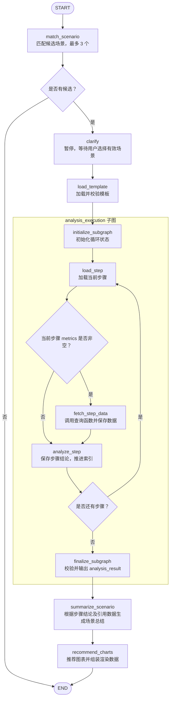

# 智能问答（单个场景）

将单次智能问答编排为**固定工作流：场景匹配 → 用户确认 → 取数与分析循环 → 综合场景总结 → 图表推荐**。父 Graph 负责场景选择和最终输出，`analysis_execution` Subgraph 负责逐步取数与分析；模板决定步骤内容与数量，Graph 控制顺序、分支和暂停恢复。

## 执行流程图

下图展示普通分析图的业务流程；聊天入口增加的输入和展示节点见后文。菱形表示条件路由，不是独立节点。

## LangGraph节点定义

### 父 Graph

父图将整个分析循环视为一个 `analysis_execution` 节点，不直接管理步骤索引或中间数据。

| 节点 | 职责与主要输入 | 主要输出 |
| --- | --- | --- |
| `match_scenario` | 根据 `question` 和上下文中的场景目录调用模型匹配，校验候选编码，按置信度排序并保留最多 3 个 | `candidates`、场景选择追问 `clarification`；重置 `scenario_id` |
| `clarify` | 将追问和候选传给 `interrupt()`，等待用户提交本次候选中的场景编码；无效选择继续等待 | `scenario_id`，并清空 `clarification` |
| `load_template` | 按 `scenario_id` 从模板来源加载唯一场景，校验字段及步骤，将步骤按连续的 `step_id` 排序 | 规范化的 `template` 快照 |
| `analysis_execution` | 接收 `template`，执行完整分析子图 | `analysis_result`，包含数据集与步骤结论 |
| `summarize_scenario` | 读取模板、全部步骤结论及其引用的数据，调用模型额外生成场景级总结 | `summary` |
| `recommend_charts` | 根据场景信息、总结及步骤实际使用的数据生成图表决策，由代码校验来源、字段和图型适用条件并组装数据 | `chart_recommendations`，包含推荐或不推荐的原因；推荐项附带数据和单位 |

图表节点不重新取数，每条建议只引用一个已有数据集，不隐式聚合或拼接；没有候选数据时直接返回不推荐结果，不调用推荐模型。

### 分析 Subgraph

| 节点 | 主要输入 | 职责与输出 |
| --- | --- | --- |
| `initialize_subgraph` | `template` | 确认模板非空，将 `step_index` 置为 0，清空 `current_step`、`datasets` 和 `step_results` |
| `load_step` | `template`、`step_index` | 读取并校验 `template.steps[step_index]`，写入 `current_step` |
| `fetch_step_data` | 模板场景信息、当前步骤文本与 `metrics`、已存数据 | 构建查询请求并调用 `AgentContext.query_data`；全部响应校验通过后写入 `datasets`，不推进索引 |
| `analyze_step` | 当前步骤、模板场景信息及该步骤允许使用的证据 | 调用模型生成完整结论，追加 `StepResult`，同时将 `step_index` 加 1 |
| `finalize_subgraph` | `step_index`、`step_results`、`datasets` | 校验步骤已全部完成、结果顺序及数据引用一致，组装唯一业务输出 `analysis_result` |

`analyze_step` 的证据范围由当前步骤的 `metrics` 决定：有指标时只读取本步骤查询数据；无指标时读取前序步骤结论，不读取原始数据，结果中的 `dataset_ids` 为空。

每个有指标步骤通过一次查询返回一张或多张表，数据集以 `step:{step_id}:table:{序号}` 标识，并保存请求快照。若状态中已存在与当前请求一致且校验通过的数据，则复用；查询失败不会写入部分响应，结论未完整生成也不会推进步骤。

### 聊天入口附加节点

`build_chat_graph()` 复用上述业务路线，并增加以下节点：

| 节点 | 位置与职责 | 主要输出 |
| --- | --- | --- |
| `prepare_chat` | 在场景匹配前校验 `question` 或新用户消息，初始化本次分析，保留线程消息历史 | 初始业务状态、`messages`、`analysis_id`、`last_question`、`status` |
| `present_clarification` | 在 `clarify` 前将追问转为聊天消息；实际暂停由 `clarify` 执行 | `messages`、等待状态 |
| `no_match` | 无候选时输出未匹配提示，然后结束 | `messages`、完成状态 |
| `present_charts` | 图表推荐后生成展示消息，附带完整图表决策，然后结束 | `messages`、完成状态 |

聊天父图通过 `chat_analysis_execution` 包装器调用子图：运行中发送步骤进度和文本增量，子图完成后再将步骤结论与完成记录写入父图的 `messages`、`execution`。这些展示字段不进入子图 State。

## LangGraph工作流

### State 与调用边界

| 边界 | 状态或契约 | 保存内容 |
| --- | --- | --- |
| 普通父图 | `AgentState` | 问题、候选、已选场景、追问、模板，以及完成后的 `analysis_result`、`summary`、`chart_recommendations` |
| 聊天父图 | `ChatState`，外部输入为 `StudioInput` | 在 `AgentState` 上增加消息、分析标识、状态和执行进度；外部仅提交 `question` 或 `messages` |
| 子图输入 | `AnalysisExecutionInput` | 仅 `template` |
| 子图内部 | `AnalysisExecutionState` | 模板及循环字段 `step_index`、`current_step`、`datasets`、`step_results` |
| 子图输出 | `AnalysisExecutionOutput` | 仅 `analysis_result = {datasets, step_results}` |

节点通过返回字段更新 State；业务字段采用覆盖更新，因此子图追加数据和结论时返回合并后的完整集合。聊天消息使用 `add_messages` 合并，`execution` 按记录键合并。

`step_index` 是从 0 开始的执行位置，`step_id` 是从 1 开始的模板步骤编号。循环字段只存在于子图，父图在子图完成后接收汇总结果，再执行总结和图表推荐。

`AgentContext` 提供场景目录、模板路径和查询函数，不写入业务 State；模型通过 `get_llm()` 获取。聊天子图所需的 `analysis_id` 等展示标识通过调用配置的 metadata 传递，不扩展业务输入输出。

当前子图不接收原始 `question`，取数请求只包含模板场景信息、步骤编号与文本、指标列表；用户问题用于场景匹配，不会自动转成取数参数，也没有查询参数澄清分支。当前 `studio.py` 注入的是 `MockQueryService`，尚不是实际问数 API。

### 条件路由与暂停恢复

| 路由位置 | 判断条件 | 后续流向 |
| --- | --- | --- |
| `match_scenario` 后 | `candidates` 是否非空 | 有候选进入确认；无候选时普通图直接结束，聊天图经 `no_match` 结束 |
| `clarify` 后 | `clarification` 是否已清空 | 已清空进入 `load_template`；未清空则抛错，不进入分析 |
| 子图 `load_step` 后 | `current_step.metrics` 是否非空 | 非空进入 `fetch_step_data`，为空直接进入 `analyze_step` |
| 子图 `analyze_step` 后 | 更新后的 `step_index` 是否小于步骤总数 | 小于则回到 `load_step`，等于则进入 `finalize_subgraph`；非法索引抛错 |

即使只匹配到一个场景，也必须经过用户确认。`clarify` 使用 `interrupt()` 暂停，调用方在同一线程中通过 `Command(resume=...)` 提交候选场景编码；有效选择后继续加载模板，无需重新匹配。

确认后按模板顺序串行执行所有步骤，模型不决定下一节点，也不动态增加步骤。子图结束后固定执行 `summarize_scenario → recommend_charts`，聊天图再经 `present_charts` 结束。

普通图使用 `InMemorySaver` 保存检查点，聊天图由 Agent Server 提供检查点，子图继承父图的检查点机制。除用户确认中断外，查询或分析异常向外抛出，没有自动跳过失败步骤的路由；图表数据不满足图型条件时可降为不推荐，未知数据引用等契约错误仍会抛出。

代码入口：父图见 `src/life_insurance_business_analysis_assistant/agent/graph.py`，子图见其下 `subgraphs/analysis_execution/graph.py`；两层 State 分别定义在各自的 `state.py`，聊天适配位于 `agent/chat.py`。`langgraph.json` 当前指向 `agent/studio.py:graph`，使用聊天父图。
