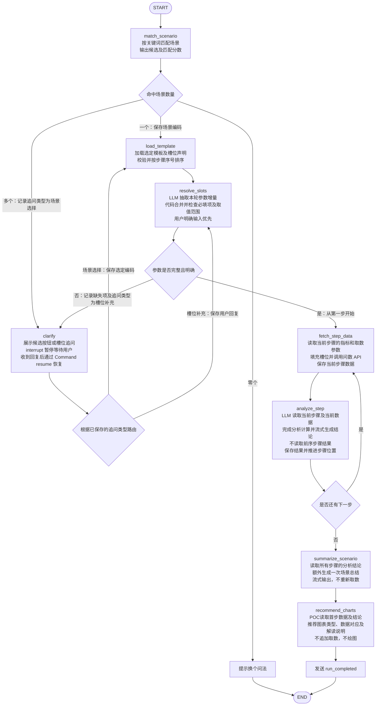

# 系统架构设计说明
**AI Service 负责模板驱动的分析执行、结论生成和图表建议；报告输出到 Markdown 为止。**

两条主链路：

- **智能问答**：关键词匹配场景 → 多命中展示候选及置信度、让用户选择，零命中提示换问法 → 提取并追问补齐模板必填槽位 → 按顺序执行普通步骤 → 读取各步分析结论，额外生成场景总结 → 推荐图表。
- **报告生成**：用户选择报告模板 → 提取并追问补齐必填槽位 → 严格按模板顺序执行 → 遇到总结步骤时，读取前序步骤结论进行综合分析 → 输出含图表建议的 Markdown。**模板外不额外追加总结。**

共同执行规则：

- 普通步骤之间不复用结果，各自按指标及时间、渠道、机构范围调用问数团队 API。
- LLM 运行时解释自然语言步骤，完成数据分析、阈值判断、排名、数量统计和结论生成。
- 用户当前明确输入优先于模板默认值和历史上下文；多轮不支持修改阈值、追加指标或跨场景分析。
- SSE 实时输出分析结论；Agent 执行过程事件待 LangGraph 节点确定后细化。
- 报告任一步失败，整个报告生成失败。

模板 CRUD、数捷对接、图表绘制、Word 导出、报告任务管理均不属于 AI Service。POC 前端可以直接对接 AI Service。


# 模板类型

## 单个场景模板

> 单个场景模板适用于智能问答，根据用户的问题匹配场景，补齐输入参数后按步骤分析。

#### 场景基本信息

- **场景名称**：场景的业务名称，如“标保经营检视”。
- **场景编码**：场景的唯一标识，用于系统内部识别。
- **渠道类型**：场景适用的业务渠道，如个险、银保、团险。
- **时间维度**：场景的分析时间粒度，如月度、季度、年度，不代表具体年月。
- **分析对象**：场景分析的业务对象层级，如集团、机构、营业区，不代表具体机构范围。
- **分析目的**：场景对应的分析目标，如经营检视、业绩追踪、异常分析。
- **触发关键词**：用户可能使用的典型表达，用于场景匹配。

#### 输入参数（槽位声明）

输入参数声明执行前需要收集的槽位；用户输入经过抽取后得到的具体值保存在本次运行状态中。每个槽位以参数名为键，包含：

- **说明**：参数的业务含义，帮助 LLM 理解和抽取用户表达。
- **类型**：参数值类型，如 `integer`、`string`。
- **必填**：执行前是否必须有值。
- **默认值**：可选，用户未提供时采用；用户当前明确输入优先。
- **最小值 / 最大值**：可选，用于月份等数值范围检查。

必填不代表必须追问。有默认值可以补齐；没有默认值且用户未提供，或输入存在歧义时，需要追问。基本信息不自动充当槽位默认值，需要采用的默认值应在输入参数中明确声明。

例如，用户输入“看看2026年8月全系统的标保达成情况”，可得到年份 `2026`、月份 `8`、机构范围“全系统”，渠道采用声明的默认值“个险”。按当前仓库模板，只输入“8月标保达成怎么样”时需要补充年份；渠道和机构范围分别采用模板声明的“个险”“全系统”。没有声明默认机构范围的模板仍需追问机构范围。

#### 分析思路

分析思路由一个或多个分析步骤组成，每个步骤包含：

- **步骤序号**：表示执行顺序，从 1 开始递增。
- **分析步骤**：用自然语言描述分析逻辑，通过 `{{参数名}}` 引用已声明的槽位。
- **指标**：当前步骤需要查询的指标列表，作为问数 API 的输入依据。
- **分析模式**：可选，如直接分析、条件筛选、排名分析。
- **取数参数**：将本次槽位值绑定到当前步骤的查询参数；具体 API 字段由问数团队契约确定。

槽位填充保留参数类型，例如年份、月份仍为整数。阈值等业务规则保留在分析步骤中，不作为用户可修改的槽位。问数 API 返回数据，LLM 按步骤完成筛选、排名、数量统计和结论生成。

#### 整体结构

```text
场景
├── 场景名称
├── 场景编码
├── 渠道类型
├── 时间维度
├── 分析对象
├── 分析目的
├── 触发关键词[]
├── 输入参数
│   └── 参数名
│       ├── 说明
│       ├── 类型
│       ├── 必填
│       ├── 默认值（可选）
│       ├── 最小值（可选）
│       └── 最大值（可选）
└── 分析思路[]
    ├── 步骤序号
    ├── 分析步骤
    ├── 指标[]
    ├── 分析模式（可选）
    └── 取数参数
```

#### YAML 示例

以下为两个独立月度步骤的简化示例；当前仓库完整模板还包含年度累计步骤，其口径已明确为本年截至所选月份，具体指标计算口径以问数 API 为准。

```yaml
场景名称: 标保经营检视
场景编码: standard_premium_review

渠道类型: 个险
时间维度: 月度
分析对象: 机构
分析目的: 经营检视

触发关键词:
  - 标保达成
  - 标保怎么样
  - 标保分析

输入参数:
  年份:
    说明: 分析数据所属年份
    类型: integer
    必填: true

  月份:
    说明: 分析数据所属月份
    类型: integer
    必填: true
    最小值: 1
    最大值: 12

  渠道:
    说明: 本次分析的业务渠道
    类型: string
    必填: true
    默认值: 个险

  机构范围:
    说明: 本次分析覆盖的机构，如全系统、北京分公司
    类型: string
    必填: true

分析思路:
  - 步骤序号: 1
    分析步骤: >-
      分析{{年份}}年{{月份}}月，{{渠道}}渠道、
      {{机构范围}}范围内的标保达成和标保达成率，
      给出总体情况。
    指标:
      - 标保达成
      - 标保达成率
    分析模式: 直接分析
    取数参数:
      年份: "{{年份}}"
      月份: "{{月份}}"
      渠道: "{{渠道}}"
      机构范围: "{{机构范围}}"

  - 步骤序号: 2
    分析步骤: >-
      分析{{年份}}年{{月份}}月，{{渠道}}渠道、
      {{机构范围}}范围内各机构的标保达成率，
      列出达成率高于70%的机构及其达成率，并统计机构数量。
    指标:
      - 标保达成率
    分析模式: 条件筛选
    取数参数:
      年份: "{{年份}}"
      月份: "{{月份}}"
      渠道: "{{渠道}}"
      机构范围: "{{机构范围}}"
```

第一步需要总体数据，第二步需要逐机构数据。问数 API 如何区分总体与明细，待与问数团队确定；不能仅凭相同指标名称推断返回粒度。

## 完整报告模板

> 完整报告模板用于描述一类标准经营分析报告，包括**报告基本信息、章节板块和写作风格与格式要求**三部分。
> 
> 

### 报告基本信息

- **渠道类型**：报告适用的业务渠道，如个险、团险、银保。

- **时间维度**：报告默认的分析时间粒度，如月度、季度、年度。

- **分析对象**：报告主要分析的业务对象，如集团、分公司、营业区。

- **分析目的**：报告对应的业务分析目标，如经营检视、业绩追踪、专项分析。

### 章节板块

完整报告由一个或多个章节板块组成，每个章节板块包含：

- **板块名称**：章节名称，如“人力概况”“标保概况”。

- **分析逻辑**：使用自然语言描述一个具体的动作逻辑或该章节整体的分析思路。

    - 对于结构简单、不需要继续拆分子板块的章节，可以在此定义清晰可执行的分析步骤，AI Service据此执行具体的动作。

    - 对于逻辑复杂，需要拆分为子板块的章节，可在此填写整体的分析思路，对后续子板块的分析步骤起指导作用，无需发生实际动作。

- **指标**：该章节直接涉及的业务指标。若实际分析由子板块完成，可为空。同理，可据此判断当前分析逻辑是一个具体的动作逻辑或整体分析思路。如果是具体的动作逻辑→需要访问数据→指标不能为空；如果是整体分析思路→不需要访问数据→指标可以为空。

- **分析模式**：描述该章节采用的分析方式，当前作为可选字段保留。

- **子板块**：章节下进一步拆分的分析主题，可包含一个或多个子板块。

### 子板块

子板块用于描述章节下的具体分析主题，如“活动人力”“阳光人力”。

每个子板块包含若干分析步骤，分析步骤结构与场景分析模板保持一致：

- **步骤序号**：表示步骤执行顺序。

- **分析步骤**：使用自然语言描述需要完成的分析逻辑。

- **指标**：该步骤涉及的业务指标。

- **分析模式**：该步骤采用的分析方式，如直接查询、条件筛选等，可选。

### 写作风格与格式要求

用于约束最终报告的生成方式，包括：

- **语气风格**：约束报告整体的表达风格和措辞，如客观、专业、简洁。

- **结论风格**：约束分析结论的组织方式和表达结构。

- **单位规则**：统一金额、百分比等指标的单位和格式。

- **句式示例**：提供典型结论表达，作为报告生成时的参考。

整体结构可以抽象为：​

```text
报告

├── 渠道类型

├── 时间维度

├── 分析对象

├── 分析目的

├── 章节板块\[\]

│   ├── 板块名称

│   ├── 分析逻辑

│   ├── 指标\[\]

│   ├── 分析模式

│   └── 子板块\[\]

│       ├── 子板块名称

│       └── 分析步骤\[\]

│           ├── 步骤序号

│           ├── 分析步骤

│           ├── 指标\[\]

│           └── 分析模式

└── 写作风格与格式要求

├── 语气风格

├── 结论风格

├── 单位规则

└── 句式示例\[\]

```

```YAML
渠道类型: 个险
时间维度: 月度
分析对象: 营业区
分析目的: 经营检视

章节板块:
  - 板块名称: 人力概况
    分析逻辑: 按照各人力主题展开经营情况分析，每个主题先给出全系统总体数据，再按照达成率或阈值对机构进行分类，输出优秀与预警机构名单
    指标: []
    分析模式: null

    子板块:
      - 子板块名称: 活动人力
        分析步骤:
          - 步骤序号: 1
            分析步骤: 查询全系统的活动人力、活动人力达成率
            指标:
              - 活动人力
              - 活动人力达成率
            分析模式: 直接查询

          - 步骤序号: 2
            分析步骤: 查询活动人力达成率高于90%的机构
            指标:
              - 活动人力达成率
            分析模式: 条件筛选

      - 子板块名称: 阳光人力
        分析步骤:
          - 步骤序号: 1
            分析步骤: 查询全系统的阳光人力、阳光人力达成率
            指标:
              - 阳光人力
              - 阳光人力达成率
            分析模式: 直接查询

          - 步骤序号: 2
            分析步骤: 查询阳光人力达成率低于70%的机构
            指标:
              - 阳光人力达成率
            分析模式: 条件筛选

  - 板块名称: 标保概况
    分析逻辑: 分析全系统标保达成情况，并给出总体经营结论
    指标:
      - 标保达成
      - 标保达成率
    分析模式: 直接查询
    子板块: []

写作风格与格式要求:
  语气风格: 经营诊断文风，陈述客观，少抒情，重事实与落地

  结论风格: 判定先行、名单落地。每个板块先给出全系统总体数据，再根据阈值给出机构分档名单

  单位规则: 金额单位使用万元；百分比保留1位小数；百分点使用pp表示；人力使用“人”作为单位

  句式示例:
    - 全系统标保达成12444万元，标保达成率61.8%
    - 标保达成率高于70%的机构共9家，分别为新疆、天津、潍坊、云南、海南、河南、内蒙古、宁波和甘肃
    - 标保达成率低于50%的机构共8家，分别为贵州、安徽、山西、上海、青岛、宁夏、北京和深圳
```

# 核心功能

## 智能问答（单个场景）

将智能问答编排为**一张固定工作流：场景匹配 → 槽位补齐 → 取数与分析循环 → 场景总结 → 图表推荐**。模板控制步骤内容与执行次数，LangGraph 控制顺序、分支和暂停恢复。

### 执行流程
```text
开始
  ↓
匹配场景
  ├─ 零命中 → 提示换个问法 → 结束
  ├─ 多命中 → 展示候选及置信度 → 等待用户选择
  └─ 单命中 → 直接采用
  ↓
加载并校验选定的场景模板
  ↓
抽取槽位并检查完整性
  ├─ 缺失或存在歧义 → 追问 → 等待用户补充 → 再次抽取检查
  └─ 参数完整 → 继续
  ↓
取出当前步骤，调用问数 API 获取数据
  ↓
LLM 按当前步骤分析数据，流式生成步骤结论
  ↓
保存当前步骤结果，推进步骤位置
  ├─ 还有步骤 → 返回取数节点
  └─ 全部完成 → 继续
  ↓
读取所有步骤结论，流式生成场景总结
  ↓
根据本次使用的数据推荐图表
  ↓
输出完成事件
  ↓
结束
```

### LangGraph节点及职责
| 节点 | 职责 | 主要输入 | 主要输出 | 是否调用 LLM |
|---|---|---|---|---|
| `match_scenario` | 按触发关键词匹配场景，形成候选项和匹配分数 | 原始问题、可用场景目录 | 候选场景；单命中时确定场景编码 | 否 |
| `clarify` | 展示场景候选或槽位追问，暂停并接收用户回复 | 追问类型、候选项或缺失槽位 | 用户选择或补充内容 | 否 |
| `load_template` | 加载选定模板，检查必要内容，整理步骤顺序 | 场景编码 | 模板、槽位定义、有序步骤 | 否 |
| `resolve_slots` | 抽取、合并槽位，检查必填项及歧义 | 用户输入、模板槽位、已有槽位 | 完整参数，或待追问内容 | 是，完整性检查由代码完成 |
| `fetch_step_data` | 获取当前步骤，用指标与槽位参数调用问数 API | 当前步骤、完整参数 | 当前步骤数据 | 否 |
| `analyze_step` | 理解当前自然语言步骤，分析数据并生成结论；完成后推进步骤位置 | 当前步骤、参数、当前数据 | 步骤结论、保存的步骤结果 | 是 |
| `summarize_scenario` | 根据全部步骤结论生成场景总结 | 场景信息、参数、各步结论 | 场景总结 | 是 |
| `recommend_charts` | 根据实际数据和分析目的推荐图表 | 首步数据、首步说明与结论（当前 POC） | 一条图表推荐或不推荐决策 | 是 |
`clarify` 是一个共用节点，分别处理“选择场景”和“补齐槽位”。恢复后，根据追问类型返回对应位置。

### 节点模型调用策略

节点通过 `get_llm(thinking=...)` 显式选择思考模式，共用模型名称、密钥及服务地址配置，按思考开关缓存两个模型实例，不修改共享实例。不将模型配置或思考内容写入业务 State。

| 节点 | 思考模式 | 输出方式 |
|---|---|---|
| `resolve_slots` | 关闭 | `with_structured_output(SlotExtraction, method="function_calling")` |
| `analyze_step` | 开启 | 流式输出步骤结论 |
| `summarize_scenario` | 开启 | 流式输出场景总结 |
| `recommend_charts` | 开启 | `with_structured_output(ChartDecision, method="json_mode")` |

DeepSeek 思考模式不支持强制指定工具的 `tool_choice`，而当前 LangChain 的 `function_calling` 结构化输出会指定工具。因此槽位抽取关闭思考，图表推荐使用不携带工具的 JSON mode。图表提示词明确提供 JSON Schema 和输出示例；JSON mode 不保证字段及业务语义正确，仍须执行 Pydantic 和现有业务校验，失败时不保存图表结果，不自动关闭思考重试。当前安装的 `ChatDeepSeek` 会把 `json_schema` 转为 `function_calling`，不能用它替代 JSON mode。

分析与总结继续只保存完整结论正文，不保存思考内容；思考开关不改变节点顺序、状态字段或对外结果结构。API 限制参考 [DeepSeek Chat Completions](https://api-docs.deepseek.com/api/create-chat-completion/) 和 [JSON Output](https://api-docs.deepseek.com/guides/json_mode/)。

### 各阶段的具体行为

#### Prompt 管理

四个 LLM 节点的系统提示词集中保存在 `src/life_insurance_business_analysis_assistant/prompts/`，分别为 `resolve_slots.md`、`analyze_step.md`、`summarize_scenario.md`、`recommend_charts.md`。包根目录的 `prompt_loader.py` 提供 `load_prompt(name)`，通过节点名读取同名 UTF-8 Markdown 文件，不依赖进程工作目录。

节点在每次调用模型前读取 Prompt，不缓存文本；修改文件后，下一次节点调用即使用新内容。加载器保留原文，不对 JSON 或 `{{参数名}}` 执行格式化；缺失或空文件直接报错。图表节点在加载的提示词末尾追加由 `ChartDecision` 生成的 JSON Schema，避免文档中的 Schema 与代码校验结构产生偏差。动态业务数据仍由各节点组装为 Human Message（JSON），System Message 保存固定职责、规则及示例。Prompt 结构优化不改变节点输出契约、模型参数或图的路由。


##### Prompt 编写规范与职责边界

四个 Prompt 统一采用八个二级标题：01 Role、02 Task、03 Context、04 Rules、05 Workflow、06 Output、07 Edge Cases、08 Examples。模块分别描述职责、成功标准、输入含义及可信边界、业务约束、执行顺序、输出语义、异常处理和 Few-shot，不要求相同篇幅。

| 节点 | 模型接收的 Human Message | 模型与代码分工 |
|---|---|---|
| `resolve_slots` | question、user_reply、existing_slots、clarification、slot_definitions（仅 description/type） | 模型提取本轮值与歧义；代码合并状态、填默认值、校验及生成追问。Schema 通过 `SlotExtraction` 工具契约提供。 |
| `analyze_step` | scenario、step（step_id/text/analysis_mode/metrics）、slots、current_data | 模型执行模板要求的阈值判断、排名和数量统计；代码校验调用前置状态、正文非空、工具调用及截断，成功后保存完整结果并推进。无 Pydantic 正文 Schema。 |
| `summarize_scenario` | scenario、slots、conclusions（step_id/conclusion） | 模型忠实综合，不重新计算；代码保证结果编号顺序完整、文本非空及流式输出完整。不传原始数据。 |
| `recommend_charts` | analysis_purpose、step、data、conclusion、available_fields | 模型判断图型的业务适用性；代码从首步 rows 计算共有列，校验 `ChartDecision`、字段引用、步骤、观测数量及决策一致性。Schema 运行时生成，不手写副本。 |

模板步骤承载业务规则，槽位承载用户参数，查询结果承载事实；三者不互相替代。数据和结论中的文本不得改变节点任务，但单位、范围、来源和模拟声明必须保留。分析节点区分“可用数据零命中”与“数据不足”，总结节点不裁决矛盾，图表节点不能把查询参数或指标名称变成数据列。

Few-shot 使用独立虚构样例，每例包含完整 `input` 和对应 `output`，不省略顶层输入字段；正文节点以 JSON 字符串表示期望正文，仅为示例包装，真实输出仍是正文。样例不作为当前业务事实、日期锚点或默认规则。优先覆盖增量补参、明确无效值、歧义、严格阈值、缺失值、模拟限制、冲突总结和推荐拒绝；不要求每个节点相同数量。当前共 11 个示例。

##### Prompt 验证与已知限制

`tests/test_prompt_contracts.py` 解析四个 Markdown 中的示例，调用真实节点并模拟模型输出，核对八模块、结构化 Schema、System/Human 消息、动态图表 Schema 和状态更新；它不证明模型能够生成这些结果。另有 `tests/prompt_cases.json` 的 11 个独立评估样本，不放入 Few-shot，覆盖补参状态保留、无效修正、阈值边界、空数据、总结限制与冲突、时间图、缺失列和散点图。复用相同样本对比旧版与新版，正文按每例 review 标准人工复核，不能用字面相等或关键词命中代替事实正确性。

运行方式（仓库根目录）：

```powershell
.venv/Scripts/python.exe -B tests/test_prompt_contracts.py
# 在允许访问所配置模型服务的环境执行；旧目录需包含修改前的四个 .md。
.venv/Scripts/python.exe -B tests/test_prompt_contracts.py --live --baseline-dir <旧Prompt目录> --output <结果.json>
```

真实评估通过相同节点调用与校验链运行，沿用思考模式和 temperature=0；仅在评估脚本中设置 30 秒请求超时且不重试。返回 `contract_passed_semantics_need_review` 仅表示调用与代码契约通过，语义仍需复核。结果同时保存模型名、Prompt 哈希与结构化原始输出，便于识别补参是否错误重提旧值。失败会写入错误类型并停止，不把失败算成通过。无旧版目录时仅运行新版。

2026-09-17 本次验证：全部 13 个本地测试脚本通过，其中新增的示例及独立样本离线契约检查共 22 例；`git diff --check` 通过。真实模型已配置，但连接报 `APIConnectionError`，底层为 `WinError 10013` 网络权限错误；扩大网络权限的请求被自动审批拒绝，因此未完成前后模型行为对比，不能宣称准确率提升。

问题归因及保留边界：

- Prompt 层：原提示词缺少统一输入说明与系统示例，对增量、缺失值和图表语义约束不够明确，本次补齐。
- 代码层：Pydantic/节点校验保障结构，不保障正文事实正确；图表共有列校验不等于数值类型、时间序列、饼图整体关系验证。当前数据契约尚不固定，本次不引入新的解析或转换规则。
- 模型层：阈值、排序、计数及抗材料指令干扰仍需真实模型评估；本次保留架构已约定的 LLM 分析职责，未迁移到确定性计算引擎。
- 外部服务层：连接失败不能归因于 Prompt；真实问数 API 尚未接入，Fake 数据不能验证生产口径或实际全系统结果。

若后续需要确定性分析计算、通用图表数据类型校验或相对日期解析，应先确认计算职责、数据单位契约及可信日期输入，再修改实现；这些均不属于本次已实施变更。

**场景匹配**

匹配前必须已经拿到场景目录，至少包含场景编码、名称和触发关键词。POC 可以直接从模拟模板数据中读取；以后由主后端提供，工作流本身不负责 CRUD。

匹配规则按已确认范围执行：

- 零命中：返回换问法提示，本次运行结束。
- 单命中：采用该场景。
- 多命中：返回所有候选及匹配分数，必须等待用户选择，不能仅因某项分数最高而自动采用。

关键词阶段的“置信度”应明确是**规则匹配分数，不是正确概率**。具体计分公式可随模拟场景一起确定，本阶段不需要增加一次 LLM 调用来生成分数。

用户选择后，只接受本次候选中的场景编码；原始问题继续保留，后面还要从中抽取时间等参数。

**加载模板与槽位补齐**

`load_template` 负责确认模板具备必填槽位定义、步骤及步骤指标，并按照步骤序号整理执行顺序。模板加载后，本次运行一直使用这一份内容。

`resolve_slots` 分两部分：

1. LLM 在首次调用时从原始问题抽取；补参时仅抽取最新回答明确提供或修正的值，原问题、已有槽位和追问仅用于理解指代。
2. 代码合并本轮增量，填充模板默认值，检查类型、范围和必填项，保留未解决问题并生成追问。明确无效或歧义修正会移除旧值，不能用默认值掩盖。

用户后续明确补充或修正的参数覆盖已有值；模板提供默认值时可以采用。历史上下文与模板默认值之间的优先级尚未确认，POC 可以先只维护**本次分析及其补参过程**，不自动引入其他分析的上下文。

例如，用户只说“8月”，而模板要求完整年份和月份，也没有可用的明确默认年份，就应追问年份。

补充回答只是“2026年”，也能继续当前分析，不应重新进入关键词匹配。

**逐步取数与分析**

所有模板步骤复用同一组节点：

```text
fetch_step_data → analyze_step → 判断是否还有下一步
```

不为“标保分析第一步”“标保分析第二步”分别创建节点。步骤增加或减少时，只改变循环次数。

`fetch_step_data`：

- 从模板读取当前步骤的指标列表。
- 结合已补齐的时间、渠道、机构范围构造查询参数。
- 调用问数团队 API，取得当前步骤所需数据。
- 不执行筛选、排名，也不由 LLM 临时增加查询指标。

`analyze_step` 的 LLM 输入只包含：

- 场景必要背景。
- 当前步骤的自然语言说明与可选分析模式。
- 本次分析参数。
- 当前步骤查询到的数据。

**不把前序步骤结论或数据传给普通步骤。** 虽然运行状态中保存了这些结果，但普通步骤的 prompt 不读取它们。

例如，步骤要求“列出达成率高于70%的机构”，问数 API 返回指定范围内的机构达成率，LLM 完成阈值判断、名单整理、数量统计和结论生成。

步骤结论流式输出结束后，再保存完整结果并推进步骤位置。步骤数据保留在结果中，当前 POC 图表推荐只读取首步数据；这不意味着普通步骤之间复用数据。

**场景总结**

所有步骤执行完后，固定调用一次 `summarize_scenario`。

它读取**前序步骤的分析结论**，生成整体判断，不重新调用问数 API，也不额外添加模板外的分析规则。即使场景模板中偶尔已有总结性步骤，按你确定的默认规则，结束后仍执行这次场景总结。

这里需要保持一个边界：总结依据是各步结论，因此前序结论遗漏的信息不会自动被总结节点找回来。每步结论应保留该步骤要求的核心数字、名单和判断。

**图表推荐**

`recommend_charts` 在场景总结后执行，读取本次实际使用的数据，给出：

- 建议图表类型。
- 对应步骤及数据。
- 使用的维度和指标。
- 一句“怎么看”的说明。

没有足够数据支撑某类图表时，不推荐该类型，也不追加取数。图表推荐不负责生成图片或绘图代码。

智能问答与前端的最终图表格式仍可后定；节点职责可以先固定为上述内容。
**图表数据关联暂时未确定，在POC阶段默认根据第一个分析步骤的数据推荐图表。**

### 工作流状态

| 状态 | 用途 |
|---|---|
| `question` | 保存原始问题，避免候选选择或补参回复覆盖原始意图 |
| `candidates`、`scenario_id` | 保存候选及最终选定场景 |
| `template` | 保存本次使用的场景模板 |
| `slots` | 保存已经解析、确认的参数 |
| `clarification`、`user_reply` | 记录正在等待什么，以及用户的最新回复 |
| `step_index` | 指向当前待执行步骤 |
| `current_data` | 保存当前取数结果，交给分析节点 |
| `step_results` | 按步骤保存数据及完整结论，供总结和图表节点读取 |
| `summary`、`chart_recommendations` | 保存最终场景总结和图表建议 |

### 状态流程图

