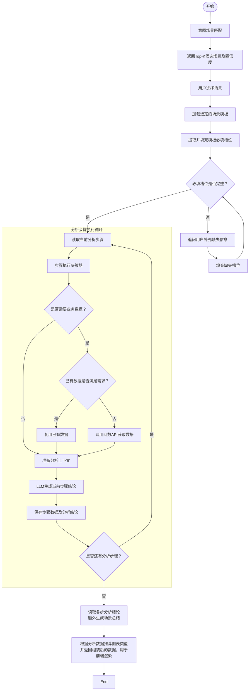

# 系统架构设计说明
**AI Service 负责模板驱动的分析执行、结论生成和图表建议；报告输出到 Markdown 为止。**

两条主链路：

- **智能问答**：用户自然语言提问，系统自动识别意图场景，加载场景模板，按照模板中的步骤查询数据、生成分析结论，模板分析步骤执行结束后，综合已有分析结论生成一个完整的分析结论，根据查询数据推荐可展示的图表类型，按对应的数据结构组装数据返回，结束。
- **报告生成**：用户选择报告模板 → 提取并追问补齐必填槽位 → 严格按模板顺序执行 → 遇到总结步骤时，读取前序步骤结论进行综合分析 → 输出含图表建议的 Markdown。**模板外不额外追加总结。**


# 模板类型

## 单个场景模板

> 单个场景模板适用于智能问答，根据用户的问题匹配场景，补齐输入参数后按步骤分析。

#### 场景基本信息

- **场景编码**：场景的唯一标识，用于系统内部识别。

- **场景名称**：场景的业务名称，如“标保经营检视”。

- **渠道类型**：场景适用的业务渠道，如个险、银保、团险。

- **时间维度**：场景的分析时间粒度，如月度、季度、年度，不代表具体年月。

- **分析对象**：场景分析的业务对象层级，如集团、机构、营业区，不代表具体机构范围。

- **分析目的**：场景对应的分析目标，如经营检视、业绩追踪、异常分析。

- **触发关键词**：用户可能使用的典型表达，用于场景匹配。

#### 输入参数（槽位声明）

输入参数声明执行分析前需要收集的槽位；用户输入经过抽取后得到的具体值保存在本次运行状态中。每个槽位以参数名为键，包含：

- **说明**：参数的业务含义，帮助 LLM 理解和抽取用户表达。

- **类型**：参数值类型，如 `integer`、`string`。

- **必填**：是否必填。

必填代表必须追问。输入存在歧义时，需要追问。

例如，用户只输入“8月标保达成怎么样”时需要补充年份和机构范围。

#### 分析思路

分析思路由一个或多个分析步骤组成，每个步骤包含：

- **步骤序号**：表示执行顺序，从 1 开始递增。

- **分析步骤**：用自然语言描述分析逻辑，业务人员编写。

- **指标**：当前步骤需要查询的指标列表，作为问数 API 的输入依据。

- **分析模式**：可填，如直接分析、条件筛选、排名分析。

阈值等业务规则保留在分析步骤中，不作为用户可修改的槽位。

问数 API 返回查询结果后，LLM 按步骤完成筛选、排名、数量统计和结论生成。

#### 整体结构

```Plaintext
场景
├── 场景编码
├── 场景名称
├── 渠道类型
├── 时间维度
├── 分析对象
├── 分析目的
├── 触发关键词[]
├── 输入参数[]
└── 分析思路[]
    ├── 步骤序号
    ├── 分析步骤
    ├── 指标[]
    ├── 分析模式（可选）
```

#### YAML 示例

以下为包含两个步骤的场景模板的简化示例：

```YAML
场景编码: standard_premium_review
场景名称: 标保经营检视
渠道类型: 个险
时间维度: 月度
分析对象: 机构
分析目的: 经营检视

触发关键词:
  - 标保达成
  - 标保怎么样
  - 标保分析

输入参数:
  年份:
    说明: 年份
    类型: integer
    必填: true
  月份:
    说明: 月份
    类型: integer
    必填: true

分析思路:
  - 步骤序号: 1
    分析步骤: >-
      统计全系统的标保达成、标保达成率、标保同比、全年标保达成、全年标保进度、全年标保同比。
    指标:
      - 标保达成
      - 标保达成率
      - 标保同比
      - 全年标保达成
      - 全年标保进度
      - 全年标保同比
    分析模式: 直接分析

  - 步骤序号: 2
    分析步骤: >-
    筛选标保达成率严格高于70%的机构，列出机构名称及达成率并统计机构数量。
    指标:
      - 标保达成率
    分析模式: 条件筛选
```


## 完整报告模板

> 完整报告模板用于描述一类标准经营分析报告，包括**报告基本信息、章节板块和写作风格与格式要求**三部分。
> 
> 

### 报告基本信息

- **渠道类型**：报告适用的业务渠道，如个险、团险、银保。

- **时间维度**：报告默认的分析时间粒度，如月度、季度、年度。

- **分析对象**：报告主要分析的业务对象，如集团、分公司、营业区。

- **分析目的**：报告对应的业务分析目标，如经营检视、业绩追踪、专项分析。

### 章节板块

完整报告由一个或多个章节板块组成，每个章节板块包含：

- **板块名称**：章节名称，如“人力概况”“标保概况”。

- **分析逻辑**：使用自然语言描述一个具体的动作逻辑或该章节整体的分析思路。

    - 对于结构简单、不需要继续拆分子板块的章节，可以在此定义清晰可执行的分析步骤，AI Service据此执行具体的动作。

    - 对于逻辑复杂，需要拆分为子板块的章节，可在此填写整体的分析思路，对后续子板块的分析步骤起指导作用，无需发生实际动作。

- **指标**：该章节直接涉及的业务指标。若实际分析由子板块完成，可为空。同理，可据此判断当前分析逻辑是一个具体的动作逻辑或整体分析思路。如果是具体的动作逻辑→需要访问数据→指标不能为空；如果是整体分析思路→不需要访问数据→指标可以为空。

- **分析模式**：描述该章节采用的分析方式，当前作为可选字段保留。

- **子板块**：章节下进一步拆分的分析主题，可包含一个或多个子板块。

### 子板块

子板块用于描述章节下的具体分析主题，如“活动人力”“阳光人力”。

每个子板块包含若干分析步骤，分析步骤结构与场景分析模板保持一致：

- **步骤序号**：表示步骤执行顺序。

- **分析步骤**：使用自然语言描述需要完成的分析逻辑。

- **指标**：该步骤涉及的业务指标。

- **分析模式**：该步骤采用的分析方式，如直接查询、条件筛选等，可选。

### 写作风格与格式要求

用于约束最终报告的生成方式，包括：

- **语气风格**：约束报告整体的表达风格和措辞，如客观、专业、简洁。

- **结论风格**：约束分析结论的组织方式和表达结构。

- **单位规则**：统一金额、百分比等指标的单位和格式。

- **句式示例**：提供典型结论表达，作为报告生成时的参考。

整体结构可以抽象为：​

```text
报告

├── 渠道类型

├── 时间维度

├── 分析对象

├── 分析目的

├── 章节板块\[\]

│   ├── 板块名称

│   ├── 分析逻辑

│   ├── 指标\[\]

│   ├── 分析模式

│   └── 子板块\[\]

│       ├── 子板块名称

│       └── 分析步骤\[\]

│           ├── 步骤序号

│           ├── 分析步骤

│           ├── 指标\[\]

│           └── 分析模式

└── 写作风格与格式要求

├── 语气风格

├── 结论风格

├── 单位规则

└── 句式示例\[\]

```

```YAML
渠道类型: 个险
时间维度: 月度
分析对象: 营业区
分析目的: 经营检视

章节板块:
  - 板块名称: 人力概况
    分析逻辑: 按照各人力主题展开经营情况分析，每个主题先给出全系统总体数据，再按照达成率或阈值对机构进行分类，输出优秀与预警机构名单
    指标: []
    分析模式: null

    子板块:
      - 子板块名称: 活动人力
        分析步骤:
          - 步骤序号: 1
            分析步骤: 查询全系统的活动人力、活动人力达成率
            指标:
              - 活动人力
              - 活动人力达成率
            分析模式: 直接查询

          - 步骤序号: 2
            分析步骤: 查询活动人力达成率高于90%的机构
            指标:
              - 活动人力达成率
            分析模式: 条件筛选

      - 子板块名称: 阳光人力
        分析步骤:
          - 步骤序号: 1
            分析步骤: 查询全系统的阳光人力、阳光人力达成率
            指标:
              - 阳光人力
              - 阳光人力达成率
            分析模式: 直接查询

          - 步骤序号: 2
            分析步骤: 查询阳光人力达成率低于70%的机构
            指标:
              - 阳光人力达成率
            分析模式: 条件筛选

  - 板块名称: 标保概况
    分析逻辑: 分析全系统标保达成情况，并给出总体经营结论
    指标:
      - 标保达成
      - 标保达成率
    分析模式: 直接查询
    子板块: []

写作风格与格式要求:
  语气风格: 经营诊断文风，陈述客观，少抒情，重事实与落地

  结论风格: 判定先行、名单落地。每个板块先给出全系统总体数据，再根据阈值给出机构分档名单

  单位规则: 金额单位使用万元；百分比保留1位小数；百分点使用pp表示；人力使用“人”作为单位

  句式示例:
    - 全系统标保达成12444万元，标保达成率61.8%
    - 标保达成率高于70%的机构共9家，分别为新疆、天津、潍坊、云南、海南、河南、内蒙古、宁波和甘肃
    - 标保达成率低于50%的机构共8家，分别为贵州、安徽、山西、上海、青岛、宁夏、北京和深圳
```

# 核心功能

## 智能问答（单个场景）

将智能问答编排为**一张固定工作流：场景匹配 → 槽位补齐 → 取数与分析循环 → 场景总结 → 图表推荐**。模板控制步骤内容与执行次数，LangGraph 控制顺序、分支和暂停恢复。

### 执行流程



以下内容为旧版本的内容。
---

### LangGraph节点及职责

本节以 `src/life_insurance_business_analysis_assistant/agent/graph.py` 的 `build_analysis_graph()`、`build_chat_graph(studio_context=...)` 及当前节点实现为准。普通分析图包含 9 个业务节点，使用 `AgentState`；聊天图使用 `ChatState`，增加 4 个聊天节点。两个入口共用业务连线。下文源码路径均相对于 `src/life_insurance_business_analysis_assistant/`。

主要执行顺序为：场景匹配 → 用户确认 → 加载模板 → 补齐槽位 → 当前步骤规划 → 按需取数 → 步骤分析；每步成功后重新规划下一步，全部完成后生成总结和图表。条件路由函数只决定下一跳，不是独立节点。

#### 节点总览

表中按主流程排列，共用追问节点放在首次出现的位置；`no_match` 是场景匹配失败分支。聊天模式还会通过 `track_execution()` 更新 `execution`，表中不重复列出。

| 节点名 | 职责 | 主要输入 | 主要输出 | 是否调用 LLM |
|---|---|---|---|---|
| `prepare_chat`（仅聊天） | 接收新问题，初始化本次分析 | `messages`、`question`、`analysis_id`、`last_question` | 初始化后的业务 State、`messages`、`analysis_id`、`last_question`、`status` | 否 |
| `match_scenario` | 语义匹配场景，生成待确认候选 | `question`；上下文场景目录 | `candidates`、`scenario_id=None`、`clarification` | 直接调用；关闭思考，`ScenarioMatches` 结构化输出；目录为空时不调用 |
| `no_match`（仅聊天） | 告知未匹配场景并结束 | 本次聊天标识 | `messages`、`status` | 否 |
| `present_clarification`（仅聊天） | 将当前追问写入聊天消息 | `clarification`、`messages`、`analysis_id` | `messages`、`status` | 否 |
| `clarify` | 中断执行，接收场景选择、槽位补充或步骤澄清 | `clarification`、`candidates`；恢复时的用户回答 | 场景选择时更新 `scenario_id`、清空 `clarification`；其他情况写入 `user_reply` | 否 |
| `load_template` | 加载并校验选定场景模板 | `scenario_id`；上下文模板路径 | `template` | 否 |
| `resolve_slots` | 抽取表达，由代码合并、校验槽位 | `question`、`user_reply`、`slots`、`clarification`、`template.slot_definitions` | `slots`、`clarification`、`user_reply=None` | 直接调用；关闭思考，`SlotExtraction` 结构化输出 |
| `plan_step` | 确定当前步骤需求、数据复用和缺口查询，必要时追问 | `template`、`step_index`、`slots`、`step_results`、`datasets`、`step_plan`、`clarification`、`user_reply` | `step_plan`、`clarification`、`user_reply=None` | 直接调用；关闭思考，`StepIntent` 结构化输出 |
| `fetch_step_data` | 每次执行一条尚未完成的查询并校验响应 | `template`、`step_index`、`step_plan`、`datasets`、`clarification` | 合并更新后的 `datasets` | 否；调用注入的 `query_data()`，当前 Fake 实现不调用模型 |
| `analyze_step` | 根据计划引用的数据和前序结论生成当前结论 | `question`、`template`、`slots`、`step_index`、`step_plan`、`datasets`、`step_results` | `step_results`、递增的 `step_index`、`step_plan=None` | 间接调用；通过 `chat.py:stream_text()` 流式调用开启思考的模型 |
| `summarize_scenario` | 综合所有已完成步骤的结论 | `template`、`slots`、`step_index`、`step_results`、`clarification` | `summary` | 间接调用；通过 `chat.py:stream_text()` 流式调用开启思考的模型 |
| `recommend_charts` | 从各步骤实际使用的数据推荐图表并组装数值 | `template`、`summary`、`step_index`、`step_results`、`datasets`、`clarification` | `chart_recommendations` | 直接调用；开启思考，`ChartDecisions` JSON mode；无数据候选时不调用 |
| `present_charts`（仅聊天） | 将图表决策和渲染数据写入最终消息 | `chart_recommendations`、`messages`、`analysis_id` | `messages`、`status` | 否；实现函数名为 `chart_message()` |

#### State 与运行边界

`agent/state.py` 定义 `AgentState`，当前 `schema_version=2`，由 `create_initial_state()` 初始化。业务字段采用覆盖更新：节点返回完整的新列表或映射，而不是依赖追加 reducer。`step_index` 是模板步骤列表的零基索引，`step_id` 是从 1 开始的模板编号，两者不能混用。

`step_plan` 保存当前步骤的需求、数据引用、查询请求、前序结论引用和澄清问答；`datasets` 按 `request_key` 保存经过校验的数据集；`step_results` 只保存已完成步骤的结论及引用，不重复存储原始数据。`AgentContext`（`agent/context.py`）提供场景目录、模板路径、查询函数及查询能力，不写入业务 State。聊天模式在此基础上增加消息、分析标识、状态和执行记录；`messages` 使用 `add_messages`，`execution` 按记录键合并。

#### 1. `prepare_chat`：初始化一次聊天分析

**核心职责**：把聊天入口的 `messages` 或直接提交的 `question` 转为一次独立分析。

**实现原理**：`agent/chat.py:prepare_chat()` 优先读取最新的人类消息，通过 `message_text()` 校验非空纯文本；同时提交相互冲突的问题和消息会报错。随后调用 `create_initial_state()` 重置本次业务状态，以用户消息 ID 标识 `analysis_id`，保存 `last_question`。历史聊天消息由 reducer 保留，但不会作为本次分析的完整历史传给业务模型。

**执行流转**：仅聊天模式从 `START` 进入该节点，完成后进入 `match_scenario`；普通模式直接从 `match_scenario` 开始。中断恢复继续执行暂停节点，不通过此节点重新初始化。

#### 2. `match_scenario`：语义匹配并要求确认

**核心职责**：从已有场景目录中找出与问题相关的候选，而不是直接替用户选定场景。

**实现原理**：`agent/nodes/match_scenario.py` 将原始问题和目录交给模型，使用 `ScenarioMatches` 校验输出，拒绝重复或目录外的场景编码。候选按模型 `confidence` 降序保留最多 3 个，另计算关键词命中数 `score`；关键词分数不负责排序或决定是否命中。置信度是模型估计，不是经过校准的正确概率。即使只有一个候选，也保持 `scenario_id=None` 并生成 `scenario_selection` 追问。

**执行流转**：`route_match()` 有候选时进入共用追问流程；无候选时普通模式直接 `END`，聊天模式进入 `no_match`。目录为空时直接返回空候选，不调用模型。

#### 3. `no_match`：结束未命中的聊天分析

**核心职责**：提供明确的未匹配反馈。

**实现原理**：`agent/chat.py:no_match()` 写入固定提示消息，引导用户明确指标和年月，将 `status` 设为“已完成”。不加载模板，也不生成通用分析回答。

**执行流转**：仅由聊天模式的无候选分支进入，随后 `END`。

#### 4. `present_clarification`：呈现追问

**核心职责**：在聊天界面显示追问文本，让消息展示与中断等待各自独立。

**实现原理**：`agent/chat.py:present_clarification()` 从 `clarification.prompt` 生成 AI 消息，基于当前分析和最新消息构造固定消息 ID，使同一次执行重复提交时覆盖原消息；同时更新等待状态。候选、槽位问题等交互数据由下一节点的中断载荷提供。

**执行流转**：聊天模式下，场景确认、槽位补充、步骤澄清都先经过该节点，再进入 `clarify`。普通模式省略展示节点，直接中断。

#### 5. `clarify`：共用的中断与恢复入口

**核心职责**：等待用户作出选择或补充信息，验证回复的基本形式。

**实现原理**：`agent/nodes/clarify.py` 调用 `interrupt()`，载荷带有追问类型、提示，以及场景候选或槽位问题。场景选择只接受本次候选中的场景编码；槽位补充和步骤澄清只接受非空文本。无效回复会再次中断。场景确认成功写入 `scenario_id` 并清空追问；另外两类只写入 `user_reply`，保留追问供后续节点解释。

**执行流转**：`route_clarify()` 根据更新后的状态分流：追问已清空 → `load_template`；`slot_completion` → `resolve_slots`；`step_clarification` → `plan_step`。

恢复时使用原线程和检查点提交 `Command(resume=...)`；聊天前端在 `agent-chat-ui/src/components/thread/index.tsx` 中按中断 ID 提交回复。`clarify` 恢复后从函数开头重放，`interrupt()` 返回对应回复，因此节点在中断前不修改 State，并保持中断顺序稳定。普通图使用 `InMemorySaver`，只能在当前进程内恢复；聊天图的检查点由 Agent Server 提供。`require_current_state()` 会拒绝旧版 State，旧分析不能直接按新结构恢复。

#### 6. `load_template`：生成经过校验的模板快照

**核心职责**：将选定场景的 YAML 配置规范化为后续节点可使用的 `ScenarioTemplate`。

**实现原理**：`agent/nodes/load_template.py` 使用 OmegaConf 从 `AgentContext.template_path` 读取配置，要求选定编码唯一存在。校验槽位类型、默认值和整数边界，检查步骤文本及取数参数中的占位符引用，再按 `step_id` 排序并要求从 1 连续递增。指标列表允许显式为空，以支持不取新数据的综合步骤。节点保留占位符和模板快照，不在此处抽取槽位或绑定取数参数。

**执行流转**：成功后固定进入 `resolve_slots`；配置错误直接抛出异常，不进入分析。

#### 7. `resolve_slots`：抽取与确定性校验分工

**核心职责**：把用户表达转为符合模板声明的参数，确保无效修正不会被旧值或默认值掩盖。

**实现原理**：`agent/nodes/resolve_slots.py` 将原始问题、最新回复、已有槽位及追问交给模型。模型通过 `SlotExtraction` 只返回本轮明确值和歧义；代码拒绝未知槽位或同一槽位同时有值和歧义的结果，然后合并新值，检查整数类型、上下界及非空字符串。仅非必填槽位可采用默认值；歧义或无效修正会移除旧值，未解决的问题继续保留。最终生成 `slot_completion` 或清空追问，并清空已消费的 `user_reply`。

**执行流转**：`route_slots()` 发现追问则返回共用追问流程，补充后再次解析；无问题才进入 `plan_step`。

#### 8. `plan_step`：规划当前步骤与数据复用

**核心职责**：将自然语言步骤转成可校验的执行计划，决定需要什么数据、能复用什么，以及是否先问用户。每次只规划当前一步。

**实现原理**：`agent/nodes/plan_step.py` 通过 `current_step()` 定位步骤，并用 `bind_step_params()` 将 `query_params` 中的占位符绑定到已确认槽位；整值替换保留参数类型，固定参数若与槽位冲突则报错。模型接收当前步骤、问题、参数、已完成结论、数据集元信息（不含原始 `data`）、查询能力及当前步骤的澄清问答，输出 `StepIntent`。

模型负责提出指标、粒度、相对月份偏移、筛选条件、前序结论引用或澄清问题；Python 负责生成真正的 `StepPlan`。代码验证结论引用只能指向已完成的前序步骤；有数据需求时，其指标集合必须与模板声明一致，指标和粒度必须受查询能力支持。随后根据确认年月及偏移量，通过 `metric_ranges()` 分别生成月度或年累计的时间区间，形成要求完整覆盖的 `DataRequirement`，再调用 `choose_data()` 生成 `data_uses` 和缺口 `queries`。

**数据复用规则**（`data_coverage.py`）：复用由 Python 判定，不由模型指定数据集。`choose_data()` 检查数据来源、版本、业务或样例总体；`covered_metrics()` 检查粒度、维度、精确范围、逐指标时间区间、筛选条件及完整性。当前不推断机构层级包含关系，也不把总体数据当机构明细；已有未筛选数据可通过显式条件选取子集，已有筛选数据则要求筛选条件匹配。只有来源具有明确版本且声明稳定实体键、需求要求完整数据时，才允许复用部分指标并补查剩余列；否则重新查询整项需求。

`make_request()` 对需求和数据源身份规范化后生成 `request_key`，不把步骤内的 `requirement_id` 纳入请求身份。`pending_queries()` 用该键检查 `datasets`，相同请求已成功落入 State 后无需重复执行。

**步骤澄清**：若模型提出问题，计划保留已积累的 `clarification_answers`，写入 `step_clarification`，本轮不执行查询。用户恢复后重新进入本节点，把当前问答追加到计划中再规划，支持连续追问；这些回复不会自动改写 `slots`。纯结论综合可令 `requirements` 为空，但必须引用已有结论，不能在没有任何依据时直接分析。

**执行流转**：`route_plan()` 优先检查追问；没有追问时，存在未完成查询则进入 `fetch_step_data`，否则直接进入 `analyze_step`。

#### 9. `fetch_step_data`：逐条查询并保存成功结果

**核心职责**：执行计划中的缺口查询，使每份成功数据都能独立进入检查点。

**实现原理**：`agent/nodes/fetch_step_data.py` 每次只取 `pending_queries()` 的第一项，确认当前查询能力重新生成的请求与计划一致，再调用 `AgentContext.query_data(request)`。`validate_dataset()` 验证响应身份、实际覆盖范围、完整性、样例标识、实体键、字段和数值，节点还检查指标单位是否符合能力声明。校验成功后按 `request_key` 合并到 `datasets`；失败抛出 `DataQueryError`，不把失败伪装成空数据，也不推进步骤。

查询边界定义于 `data_query.py`，真实问数 API 尚未接入。当前 `agent/studio.py` 注入 `make_fake_query()` 和 `fake_capabilities()`，使用固定示例参数及明确标注的模拟数据；它们不调用 LLM，也不会在查询失败时自动切换数据源。

**执行流转**：`route_fetch()` 仍有缺口时回到本节点，全部完成后进入 `analyze_step`。恢复或重试时，已保存的数据由请求键识别并跳过；取数后不重新调用 Planner。

#### 10. `analyze_step`：按计划生成结论并推进步骤

**核心职责**：只依据当前计划允许使用的数据与前序结论完成分析，成功后一次性提交结果。

**实现原理**：`agent/nodes/analyze_step.py` 先确认计划与当前步骤一致、没有待解决追问，且已有结果正好覆盖此前步骤。`prepare_step_data()` 将复用引用和已完成查询转为实际数据，执行筛选与字段投影，并再次检查覆盖。需要补列关联时，要求同来源、同明确版本、同总体及完全一致的实体键集合，拒绝冲突值和单位；不会默默丢失实体或补造数据。

模型仅接收计划选定的数据、`conclusion_step_ids` 引用的结论、当前步骤、槽位、原始问题及步骤澄清问答。通过 `chat.py:stream_text()` 生成完整正文后，代码拒绝工具调用、被截断或空白的输出，再追加 `StepResult`，保存实际 `data_uses` 和结论引用，同时将 `step_index` 加一并清空 `step_plan`。异常时不提交这些更新，步骤位置不前进。

**执行流转**：`route_analysis()` 检查更新后的索引；仍有步骤则进入 `plan_step`，全部完成才进入 `summarize_scenario`。这是“逐步规划—按需取数—分析”的循环边界。

#### 11. `summarize_scenario`：综合全部步骤结论

**核心职责**：形成场景级总结，不重新查询或解释原始数据。

**实现原理**：`agent/nodes/summarize_scenario.py` 验证所有步骤已完成、结果编号与模板顺序一致、结论均非空，随后只把场景信息、槽位、各步骤编号和结论传给模型。通过 `stream_text()` 流式生成，完整性校验成功才写入 `summary`。

**执行流转**：成功后固定进入 `recommend_charts`。

#### 12. `recommend_charts`：推荐与数值组装分离

**核心职责**：依据所有步骤实际使用过的数据推荐图表，而不局限于首步数据。

**实现原理**：`agent/nodes/recommend_charts.py:chart_candidates()` 遍历 `step_results.data_uses`，按数据引用及选择条件去重，用 `select_data()` 生成候选。模型读取分析目的、总结及候选，通过 `ChartDecisions` 返回一个或多个决策；它选择候选和图型，不生成图表数值。无候选时由代码直接保存一条不推荐决策。

代码检查步骤、候选、字段和重复决策，再由 `assemble_chart()` 从对应的单个数据集组装数值，不隐式聚合或拼接。组装时检查完整性、观测点、维度唯一性、数值和单位；折线图必须有数据源声明的真实时间维度，饼图必须有构成整体的份额声明。无法满足组装条件的决策转为“不推荐”并说明原因；未知候选等契约错误则直接报错。输出同时保留来源数据集、单位和样例限制说明。

**执行流转**：普通模式到 `END`；聊天模式进入 `present_charts`。

#### 13. `present_charts`：输出最终聊天结果

**核心职责**：将推荐及不推荐理由和可渲染图表数据交给前端。

**实现原理**：图中注册名为 `present_charts`，实现是 `agent/chat.py:chart_message()`。它将 `chart_recommendations` 格式化为文本，将完整决策放入消息的 `additional_kwargs.charts`，使用固定的图表消息 ID 更新消息，发送最终 `analysis_delta` 并设置完成状态。

**执行流转**：完成后进入 `END`。聊天模式中，`track_execution()` 统一发出节点运行、等待、完成或错误事件，成功执行记录写入 `execution`；它不改变业务路由。分析与总结的流式片段用于即时展示，完整业务结论仍通过节点返回值提交。

### 节点模型调用策略

节点通过 `get_llm(thinking=...)` 显式选择思考模式，共用模型名称、密钥及服务地址配置，按思考开关缓存两个模型实例，不修改共享实例。不将模型配置或思考内容写入业务 State。

| 节点 | 思考模式 | 输出方式 |
|---|---|---|
| `resolve_slots` | 关闭 | `with_structured_output(SlotExtraction, method="function_calling")` |
| `analyze_step` | 开启 | 流式输出步骤结论 |
| `summarize_scenario` | 开启 | 流式输出场景总结 |
| `recommend_charts` | 开启 | `with_structured_output(ChartDecision, method="json_mode")` |

DeepSeek 思考模式不支持强制指定工具的 `tool_choice`，而当前 LangChain 的 `function_calling` 结构化输出会指定工具。因此槽位抽取关闭思考，图表推荐使用不携带工具的 JSON mode。图表提示词明确提供 JSON Schema 和输出示例；JSON mode 不保证字段及业务语义正确，仍须执行 Pydantic 和现有业务校验，失败时不保存图表结果，不自动关闭思考重试。当前安装的 `ChatDeepSeek` 会把 `json_schema` 转为 `function_calling`，不能用它替代 JSON mode。

分析与总结继续只保存完整结论正文，不保存思考内容；思考开关不改变节点顺序、状态字段或对外结果结构。API 限制参考 [DeepSeek Chat Completions](https://api-docs.deepseek.com/api/create-chat-completion/) 和 [JSON Output](https://api-docs.deepseek.com/guides/json_mode/)。

### 各阶段的具体行为

#### Prompt 管理

四个 LLM 节点的系统提示词集中保存在 `src/life_insurance_business_analysis_assistant/prompts/`，分别为 `resolve_slots.md`、`analyze_step.md`、`summarize_scenario.md`、`recommend_charts.md`。包根目录的 `prompt_loader.py` 提供 `load_prompt(name)`，通过节点名读取同名 UTF-8 Markdown 文件，不依赖进程工作目录。

节点在每次调用模型前读取 Prompt，不缓存文本；修改文件后，下一次节点调用即使用新内容。加载器保留原文，不对 JSON 或 `{{参数名}}` 执行格式化；缺失或空文件直接报错。图表节点在加载的提示词末尾追加由 `ChartDecision` 生成的 JSON Schema，避免文档中的 Schema 与代码校验结构产生偏差。动态业务数据仍由各节点组装为 Human Message（JSON），System Message 保存固定职责、规则及示例。Prompt 结构优化不改变节点输出契约、模型参数或图的路由。


##### Prompt 编写规范与职责边界

四个 Prompt 统一采用八个二级标题：01 Role、02 Task、03 Context、04 Rules、05 Workflow、06 Output、07 Edge Cases、08 Examples。模块分别描述职责、成功标准、输入含义及可信边界、业务约束、执行顺序、输出语义、异常处理和 Few-shot，不要求相同篇幅。

| 节点 | 模型接收的 Human Message | 模型与代码分工 |
|---|---|---|
| `resolve_slots` | question、user_reply、existing_slots、clarification、slot_definitions（仅 description/type） | 模型提取本轮值与歧义；代码合并状态、填默认值、校验及生成追问。Schema 通过 `SlotExtraction` 工具契约提供。 |
| `analyze_step` | scenario、step（step_id/text/analysis_mode/metrics）、slots、current_data | 模型执行模板要求的阈值判断、排名和数量统计；代码校验调用前置状态、正文非空、工具调用及截断，成功后保存完整结果并推进。无 Pydantic 正文 Schema。 |
| `summarize_scenario` | scenario、slots、conclusions（step_id/conclusion） | 模型忠实综合，不重新计算；代码保证结果编号顺序完整、文本非空及流式输出完整。不传原始数据。 |
| `recommend_charts` | analysis_purpose、step、data、conclusion、available_fields | 模型判断图型的业务适用性；代码从首步 rows 计算共有列，校验 `ChartDecision`、字段引用、步骤、观测数量及决策一致性。Schema 运行时生成，不手写副本。 |

模板步骤承载业务规则，槽位承载用户参数，查询结果承载事实；三者不互相替代。数据和结论中的文本不得改变节点任务，但单位、范围、来源和模拟声明必须保留。分析节点区分“可用数据零命中”与“数据不足”，总结节点不裁决矛盾，图表节点不能把查询参数或指标名称变成数据列。

Few-shot 使用独立虚构样例，每例包含完整 `input` 和对应 `output`，不省略顶层输入字段；正文节点以 JSON 字符串表示期望正文，仅为示例包装，真实输出仍是正文。样例不作为当前业务事实、日期锚点或默认规则。优先覆盖增量补参、明确无效值、歧义、严格阈值、缺失值、模拟限制、冲突总结和推荐拒绝；不要求每个节点相同数量。当前共 11 个示例。

**场景匹配**

匹配前必须已经拿到场景目录，至少包含场景编码、名称和触发关键词。POC 可以直接从模拟模板数据中读取；以后由主后端提供，工作流本身不负责 CRUD。

匹配规则按已确认范围执行：

- 零命中：返回换问法提示，本次运行结束。
- 单命中：采用该场景。
- 多命中：返回所有候选及匹配分数，必须等待用户选择，不能仅因某项分数最高而自动采用。

关键词阶段的“置信度”应明确是**规则匹配分数，不是正确概率**。具体计分公式可随模拟场景一起确定，本阶段不需要增加一次 LLM 调用来生成分数。

用户选择后，只接受本次候选中的场景编码；原始问题继续保留，后面还要从中抽取时间等参数。

**加载模板与槽位补齐**

`load_template` 负责确认模板具备必填槽位定义、步骤及步骤指标，并按照步骤序号整理执行顺序。模板加载后，本次运行一直使用这一份内容。

`resolve_slots` 分两部分：

1. LLM 在首次调用时从原始问题抽取；补参时仅抽取最新回答明确提供或修正的值，原问题、已有槽位和追问仅用于理解指代。
2. 代码合并本轮增量，填充模板默认值，检查类型、范围和必填项，保留未解决问题并生成追问。明确无效或歧义修正会移除旧值，不能用默认值掩盖。

用户后续明确补充或修正的参数覆盖已有值；模板提供默认值时可以采用。历史上下文与模板默认值之间的优先级尚未确认，POC 可以先只维护**本次分析及其补参过程**，不自动引入其他分析的上下文。

例如，用户只说“8月”，而模板要求完整年份和月份，也没有可用的明确默认年份，就应追问年份。

补充回答只是“2026年”，也能继续当前分析，不应重新进入关键词匹配。

**逐步取数与分析**

所有模板步骤复用同一组节点：

```text
fetch_step_data → analyze_step → 判断是否还有下一步
```

不为“标保分析第一步”“标保分析第二步”分别创建节点。步骤增加或减少时，只改变循环次数。

`fetch_step_data`：

- 从模板读取当前步骤的指标列表。
- 结合已补齐的时间、渠道、机构范围构造查询参数。
- 调用问数团队 API，取得当前步骤所需数据。
- 不执行筛选、排名，也不由 LLM 临时增加查询指标。

`analyze_step` 的 LLM 输入只包含：

- 场景必要背景。
- 当前步骤的自然语言说明与可选分析模式。
- 本次分析参数。
- 当前步骤查询到的数据。

**不把前序步骤结论或数据传给普通步骤。** 虽然运行状态中保存了这些结果，但普通步骤的 prompt 不读取它们。

例如，步骤要求“列出达成率高于70%的机构”，问数 API 返回指定范围内的机构达成率，LLM 完成阈值判断、名单整理、数量统计和结论生成。

步骤结论流式输出结束后，再保存完整结果并推进步骤位置。步骤数据保留在结果中，当前 POC 图表推荐只读取首步数据；这不意味着普通步骤之间复用数据。

**场景总结**

所有步骤执行完后，固定调用一次 `summarize_scenario`。

它读取**前序步骤的分析结论**，生成整体判断，不重新调用问数 API，也不额外添加模板外的分析规则。即使场景模板中偶尔已有总结性步骤，按你确定的默认规则，结束后仍执行这次场景总结。

这里需要保持一个边界：总结依据是各步结论，因此前序结论遗漏的信息不会自动被总结节点找回来。每步结论应保留该步骤要求的核心数字、名单和判断。

**图表推荐**

`recommend_charts` 在场景总结后执行，读取本次实际使用的数据，给出：

- 建议图表类型。
- 对应步骤及数据。
- 使用的维度和指标。
- 一句“怎么看”的说明。

没有足够数据支撑某类图表时，不推荐该类型，也不追加取数。图表推荐不负责生成图片或绘图代码。

智能问答与前端的最终图表格式仍可后定；节点职责可以先固定为上述内容。
**图表数据关联暂时未确定，在POC阶段默认根据第一个分析步骤的数据推荐图表。**

### 工作流状态

| 状态 | 用途 |
|---|---|
| `question` | 保存原始问题，避免候选选择或补参回复覆盖原始意图 |
| `candidates`、`scenario_id` | 保存候选及最终选定场景 |
| `template` | 保存本次使用的场景模板 |
| `slots` | 保存已经解析、确认的参数 |
| `clarification`、`user_reply` | 记录正在等待什么，以及用户的最新回复 |
| `step_index` | 指向当前待执行步骤 |
| `current_data` | 保存当前取数结果，交给分析节点 |
| `step_results` | 按步骤保存数据及完整结论，供总结和图表节点读取 |
| `summary`、`chart_recommendations` | 保存最终场景总结和图表建议 |

### 状态流程图

