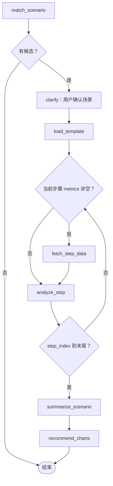

# 系统架构设计说明
**AI Service 负责模板驱动的分析执行、结论生成和图表建议；报告输出到 Markdown 为止。**

两条主链路：

- **智能问答**：用户自然语言提问，系统自动识别意图场景，加载场景模板，按照模板中的步骤查询数据、生成分析结论，模板分析步骤执行结束后，综合已有分析结论生成一个完整的分析结论，根据查询数据推荐可展示的图表类型，按对应的数据结构组装数据返回，结束。
- **报告生成**：用户选择报告模板 → 提取并追问补齐必填槽位 → 严格按模板顺序执行 → 遇到总结步骤时，读取前序步骤结论进行综合分析 → 输出含图表建议的 Markdown。**模板外不额外追加总结。**


# 模板类型

## 单个场景模板

> 单个场景模板适用于智能问答，根据用户的问题匹配并确认场景后，按步骤指标决定是否取数。

#### 场景基本信息

- **场景编码**：场景的唯一标识，用于系统内部识别。

- **场景名称**：场景的业务名称，如“标保经营检视”。

- **渠道类型**：场景适用的业务渠道，如个险、银保、团险。

- **时间维度**：场景的分析时间粒度，如月度、季度、年度，不代表具体年月。

- **分析对象**：场景分析的业务对象层级，如集团、机构、营业区，不代表具体机构范围。

- **分析目的**：场景对应的分析目标，如经营检视、业绩追踪、异常分析。

- **触发关键词**：用户可能使用的典型表达，用于场景匹配。

#### 分析思路

分析思路由一个或多个分析步骤组成，每个步骤包含：

- **步骤序号**：表示执行顺序，从 1 开始递增。

- **分析步骤**：用自然语言描述分析逻辑，业务人员编写。

- **指标**：当前步骤需要查询的指标列表，作为问数 API 的输入依据。

- **分析模式**：可填，如直接分析、条件筛选、排名分析。

阈值等业务规则保留在分析步骤中，不作为用户可修改的槽位。

问数 API 返回查询结果后，LLM 按步骤完成筛选、排名、数量统计和结论生成。

#### 整体结构

```Plaintext
场景
├── 场景编码
├── 场景名称
├── 渠道类型
├── 时间维度
├── 分析对象
├── 分析目的
├── 触发关键词[]
└── 分析思路[]
    ├── 步骤序号
    ├── 分析步骤
    ├── 指标[]
    ├── 分析模式（可选）
```

#### YAML 示例

以下为包含两个步骤的场景模板的简化示例：

```YAML
场景编码: standard_premium_review
场景名称: 标保经营检视
渠道类型: 个险
时间维度: 月度
分析对象: 机构
分析目的: 经营检视

触发关键词:
  - 标保达成
  - 标保怎么样
  - 标保分析

分析思路:
  - 步骤序号: 1
    分析步骤: >-
      统计全系统的标保达成、标保达成率、标保同比、全年标保达成、全年标保进度、全年标保同比。
    指标:
      - 标保达成
      - 标保达成率
      - 标保同比
      - 全年标保达成
      - 全年标保进度
      - 全年标保同比
    分析模式: 直接分析

  - 步骤序号: 2
    分析步骤: >-
    筛选标保达成率严格高于70%的机构，列出机构名称及达成率并统计机构数量。
    指标:
      - 标保达成率
    分析模式: 条件筛选
```


## 完整报告模板

> 完整报告模板用于描述一类标准经营分析报告，包括**报告基本信息、章节板块和写作风格与格式要求**三部分。
> 
> 

### 报告基本信息

- **渠道类型**：报告适用的业务渠道，如个险、团险、银保。

- **时间维度**：报告默认的分析时间粒度，如月度、季度、年度。

- **分析对象**：报告主要分析的业务对象，如集团、分公司、营业区。

- **分析目的**：报告对应的业务分析目标，如经营检视、业绩追踪、专项分析。

### 章节板块

完整报告由一个或多个章节板块组成，每个章节板块包含：

- **板块名称**：章节名称，如“人力概况”“标保概况”。

- **分析逻辑**：使用自然语言描述一个具体的动作逻辑或该章节整体的分析思路。

    - 对于结构简单、不需要继续拆分子板块的章节，可以在此定义清晰可执行的分析步骤，AI Service据此执行具体的动作。

    - 对于逻辑复杂，需要拆分为子板块的章节，可在此填写整体的分析思路，对后续子板块的分析步骤起指导作用，无需发生实际动作。

- **指标**：该章节直接涉及的业务指标。若实际分析由子板块完成，可为空。同理，可据此判断当前分析逻辑是一个具体的动作逻辑或整体分析思路。如果是具体的动作逻辑→需要访问数据→指标不能为空；如果是整体分析思路→不需要访问数据→指标可以为空。

- **分析模式**：描述该章节采用的分析方式，当前作为可选字段保留。

- **子板块**：章节下进一步拆分的分析主题，可包含一个或多个子板块。

### 子板块

子板块用于描述章节下的具体分析主题，如“活动人力”“阳光人力”。

每个子板块包含若干分析步骤，分析步骤结构与场景分析模板保持一致：

- **步骤序号**：表示步骤执行顺序。

- **分析步骤**：使用自然语言描述需要完成的分析逻辑。

- **指标**：该步骤涉及的业务指标。

- **分析模式**：该步骤采用的分析方式，如直接查询、条件筛选等，可选。

### 写作风格与格式要求

用于约束最终报告的生成方式，包括：

- **语气风格**：约束报告整体的表达风格和措辞，如客观、专业、简洁。

- **结论风格**：约束分析结论的组织方式和表达结构。

- **单位规则**：统一金额、百分比等指标的单位和格式。

- **句式示例**：提供典型结论表达，作为报告生成时的参考。

整体结构可以抽象为：​

```text
报告

├── 渠道类型

├── 时间维度

├── 分析对象

├── 分析目的

├── 章节板块\[\]

│   ├── 板块名称

│   ├── 分析逻辑

│   ├── 指标\[\]

│   ├── 分析模式

│   └── 子板块\[\]

│       ├── 子板块名称

│       └── 分析步骤\[\]

│           ├── 步骤序号

│           ├── 分析步骤

│           ├── 指标\[\]

│           └── 分析模式

└── 写作风格与格式要求

├── 语气风格

├── 结论风格

├── 单位规则

└── 句式示例\[\]

```

```YAML
渠道类型: 个险
时间维度: 月度
分析对象: 营业区
分析目的: 经营检视

章节板块:
  - 板块名称: 人力概况
    分析逻辑: 按照各人力主题展开经营情况分析，每个主题先给出全系统总体数据，再按照达成率或阈值对机构进行分类，输出优秀与预警机构名单
    指标: []
    分析模式: null

    子板块:
      - 子板块名称: 活动人力
        分析步骤:
          - 步骤序号: 1
            分析步骤: 查询全系统的活动人力、活动人力达成率
            指标:
              - 活动人力
              - 活动人力达成率
            分析模式: 直接查询

          - 步骤序号: 2
            分析步骤: 查询活动人力达成率高于90%的机构
            指标:
              - 活动人力达成率
            分析模式: 条件筛选

      - 子板块名称: 阳光人力
        分析步骤:
          - 步骤序号: 1
            分析步骤: 查询全系统的阳光人力、阳光人力达成率
            指标:
              - 阳光人力
              - 阳光人力达成率
            分析模式: 直接查询

          - 步骤序号: 2
            分析步骤: 查询阳光人力达成率低于70%的机构
            指标:
              - 阳光人力达成率
            分析模式: 条件筛选

  - 板块名称: 标保概况
    分析逻辑: 分析全系统标保达成情况，并给出总体经营结论
    指标:
      - 标保达成
      - 标保达成率
    分析模式: 直接查询
    子板块: []

写作风格与格式要求:
  语气风格: 经营诊断文风，陈述客观，少抒情，重事实与落地

  结论风格: 判定先行、名单落地。每个板块先给出全系统总体数据，再根据阈值给出机构分档名单

  单位规则: 金额单位使用万元；百分比保留1位小数；百分点使用pp表示；人力使用“人”作为单位

  句式示例:
    - 全系统标保达成12444万元，标保达成率61.8%
    - 标保达成率高于70%的机构共9家，分别为新疆、天津、潍坊、云南、海南、河南、内蒙古、宁波和甘肃
    - 标保达成率低于50%的机构共8家，分别为贵州、安徽、山西、上海、青岛、宁夏、北京和深圳
```

# 核心功能

## 智能问答（单个场景）

以 `agent/graph.py` 的两个 Graph 为准。普通入口使用 AgentState 和 InMemorySaver；聊天入口使用 ChatState，由 Agent Server 提供检查点。聊天节点负责初始化消息、展示场景确认和最终图表，业务路线共用。


```mermaid
flowchart TD
    A[match_scenario] --> B{有候选？}
    B -->|否| E([结束])
    B -->|是| C[clarify：用户确认场景]
    C --> D[load_template]
    D --> R{当前步骤 metrics 非空？}
    R -->|是| F[fetch_step_data]
    R -->|否| N[analyze_step]
    F --> N
    N --> I{step_index 到末尾？}
    I -->|否| R
    I -->|是| S[summarize_scenario]
    S --> G[recommend_charts]
    G --> E
```

菱形为 conditional edge，不是独立判断节点。路由只读模板和索引，不调用模型、不更新状态。
单候选也需用户确认；无效选择再次中断。`resolve_slots` 仅保留为兼容独立组件，不在当前 Graph 中；步骤执行不再发起澄清。

### 节点与状态

| 节点 | 职责 | 提交结果 |
|---|---|---|
| load_template | 读取单场景 YAML，校验并排序步骤，允许空指标、拒绝重复指标、非空旧取数参数及运行时占位符 | template 快照 |
| fetch_step_data | 白名单构造请求，每步一次调用注入服务，校验全部表后原子保存 | datasets |
| analyze_step | 有指标时读取本步表格；无指标时读取全部已完成结论，流式生成完整正文 | step_results、step_index + 1 |
| summarize_scenario | 全部步骤完成后综合结论，不读取原始数据 | summary |
| recommend_charts | 根据所有实际引用的数据推荐图型，Python 从保存的行组装数值 | chart_recommendations |

`AgentContext` 只注入目录、模板路径及 query_data。模型客户端不放入 State。
`datasets` 是 dataset_id 到 `{step_id, request, payload}` 的映射，ID 由代码按 `step:2:table:1` 生成，只在本次分析内有效。
`StepResult` 保存 step_id、dataset_ids、conclusion_step_ids、conclusion，不复制原始数据。结论引用表示提供给分析器的依据，不是逐句归因。
`slots` 暂留作兼容字段；当前请求、分析、总结均不读取。新问题清空业务数据；消息和执行进度分别使用 reducer 保存聊天历史。

### 查询契约

`data_query.py` 定义严格 Pydantic 模型：

```text
DataQueryRequest
  scenario: scenario_id, name, channel_type, time_dimension, analysis_object, analysis_purpose
  step: step_id, text
  metrics: 非空且不重复的指标列表

DataQueryResult
  datasets[]:
    dimensions, metrics, rows, units, is_mock, complete, notice
    time_dimensions=[]
    partition_of=null
```

请求禁止额外字段，不传用户原始问题、slots、其他步骤、分析模式或推导条件。月度是时间粒度，机构是对象层级；二者不等于指定年月或具体机构范围。不能通过改写步骤文本偷偷注入槽位。因此当前接口不能保证满足用户指定年月、机构的查询；响应未说明时分析不得补写口径。

每步一次查询可返回多表，不同粒度分表。行字段必须与声明一致，维度组合唯一；无维度总体最多一行。指标必须为有限数值；百分比 61.8 配合 `%` 单位，不使用百分比字符串。单位未知用 null。返回指标集合必须等于请求指标集合，同一指标跨表单位一致。

complete 仅针对响应说明的集合，不代表真实全系统；部分数据不能宣称全量结论。空表必须说明含义，不能把失败或未知数据当作零。is_mock、空表及部分数据均必须有 notice。结构校验不证明业务真实性或权威单位口径。

不再存在 Planner、需求范围覆盖推理、能力目录、跨步骤复用、补列或关联。相同指标出现在不同步骤仍分别查询；标保五步查询五次，价值三步查询三次。

### Mock 与真实 API 的替换

`agent/studio.py` 注入 `MockQueryService(get_llm(thinking=False))`。Mock 位于 `mock_query_service.py`，提示词位于 `prompts/mock_query.md`。服务通过结构化输出生成数值，代码强制 is_mock 和模拟限制；没有硬编码业务样例回退。
结构错误最多纠正重试一次；模型未配置、网络异常或重试后仍无效时抛出 DataQueryError。结构化 JSON 不进入用户分析正文流。

不同步骤独立生成的样例不保证同一业务快照，低温度也不能保证一致；分析与总结不得跨步拼接或合并数量。若需要一致的模拟经营全景，需要单独设计服务内共享快照，不属于当前协议能力。

未来在 AgentContext 中替换 query_data 为 HTTP 适配器即可。适配器处理鉴权、HTTP 错误和实际响应到 DataQueryResult 的映射；未确认的完整性、时间轴和份额关系不能从请求反推。Graph 无需修改。

### 分析、图表与恢复

无指标步骤获得前序结论；第一步无指标且没有依据时，仅可作解释或说明数据不足，不得编造经营数字。普通步骤不加载历史原始数据。
分析正文非空、未截断且无工具调用才提交结果和索引。数据获取成功、分析失败时保留已有数据。总结、图表失败不重跑前面步骤。
图表按 dataset_id 生成候选，每张图只引用一个表；保留字段、重复维度、有限数值、单位、完整性检查。折线要求明确 time_dimensions 和 ISO 日期；饼图要求 partition_of，达成率不是份额。前端契约 dataset_id/data/units 保持不变。

同一步重复执行时，已保存请求相同即可读取已有成功结果；请求不一致时报错，不覆盖。多表全部校验后一次写入检查点，不保留半份成功响应。外部服务响应后、检查点保存前中断仍可能再次查询，不保证 exactly-once。
恢复使用同一 thread_id：场景确认使用 Command(resume=...)，失败恢复使用 None。旧规划状态不迁移，重构前的检查点需开始新分析。

### 验证

离线测试覆盖两种 Graph、Studio/聊天输入、零指标步骤、首次无依据步骤、循环推进、请求白名单、多表原子保存、响应校验、失败恢复、图表数值和 Prompt 契约。测试固定观测仅位于 tests，不进入开发运行时。真实 LLM 语义质量需另行验证。
