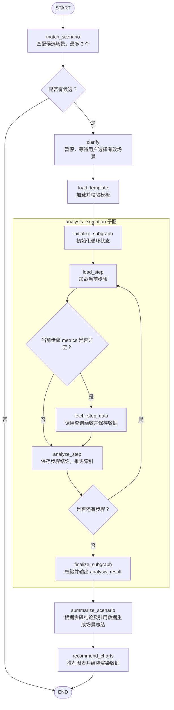

# 智能问答

## 职责与边界

本模块负责单场景的匹配、确认、分析、总结和图表输出。[graph.py](graph.py) 编排业务，[state.py](state.py) 定义状态，[presentation.py](presentation.py) 适配聊天展示；逐步取数和分析委托给 [analysis_execution](subgraphs/analysis_execution/README.md)。

入口初始化由 [父图](../../README.md) 负责。共用证据、图表和消息规则见 [shared](../../shared/README.md)，本模块不维护报告章节。

## 流程与节点

匹配 → 展示候选 → 用户确认 → 加载模板 → 分析循环 → 场景总结 → 图表推荐 → 展示结果。

| 节点 | 主要处理与输出 |
| --- | --- |
| `match_scenario` | 根据问题和场景目录匹配，校验编码，按置信度排序保留最多 3 个候选；输出候选与追问，重置场景选择 |
| `present_clarification` | 将追问转成聊天消息和等待状态 |
| `clarify` | 用 `interrupt()` 等待本次候选编码；有效选择后写入 `scenario_id` 并清空追问 |
| `load_template` | 按编码加载唯一模板，校验字段和步骤，按连续步骤编号排序并保存快照 |
| `analysis_execution` | 输入模板，输出数据集和步骤结论，不向业务图暴露内部循环状态 |
| `summarize_scenario` | 用全部步骤结论及引用数据额外生成场景总结 |
| `recommend_charts` | 根据场景、总结及实际使用的数据生成并校验图表建议 |
| `present_charts` | 输出带完整图表决策的消息，结束任务 |
| `no_match` | 无候选时提示用户并结束 |

## 状态与执行规则

- `AgentState` 保存问题、候选、已选场景、追问、模板、分析结果、总结和图表。聊天版本 `QuestionAnswerState` 再加入消息与执行进度；不要将其与入口父图 `ChatState` 混为一层。
- 单个候选也必须确认；无效选择继续等待。在同一线程用 `Command(resume=...)` 恢复，有效确认后直接加载模板，不重新匹配；追问未清空不能进入分析。
- `build_analysis_graph()` 是独立分析入口，使用 `InMemorySaver`，无候选时直接结束，不保证跨进程恢复。`build_question_answer_graph()` 增加聊天展示节点，由 Agent Server 管理检查点。
- 模板决定步骤顺序和数量，模型不动态加步骤或改变路由。查询、分析及契约错误直接抛出，没有自动跳过失败步骤的分支。
- 用户问题当前只用于场景匹配；分析子图只接收模板，不自动把问题转为查询参数，也没有查询参数澄清分支。
- `chat_analysis_execution` 在执行期间输出进度和文字，完成后再将步骤结论和完成记录写入问答层的消息与执行记录。展示标识经调用配置 metadata 传递，不扩展子图业务输入输出。

## 执行流程图

下图展示独立分析入口 `build_analysis_graph()` 的业务流程；聊天入口另有上表中的展示节点。

