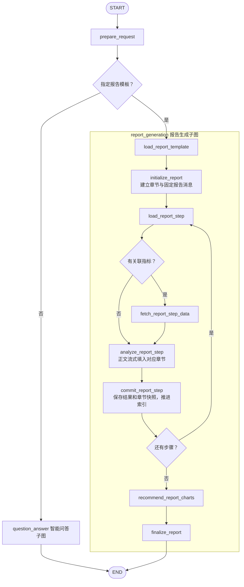

# 报告生成

## 职责与边界

本模块加载用户指定模板，管理章节和独立步骤循环，生成一份持续更新的报告。入口和模式切换见 [父图](../../README.md)，共用查询、结论生成及图表规则见 [shared](../../shared/README.md)。不复用问答的 `chat_analysis_execution` 展示包装器。

[graph.py](graph.py) 编排流程，[state.py](state.py) 定义状态，[presentation.py](presentation.py) 发布流事件，[rendering.py](rendering.py) 组装报告；模板存储由 [templates/report_store.py](../../../templates/report_store.py) 管理，兼容板块级“分析步骤”和旧字段“分析逻辑”。

## 模板展开规则

- 保留章节树，按模板排列顺序展开步骤。同一子板块的局部步骤编号须连续且与排列一致，不静默重排。当前存储仅支持“板块 → 子板块 → 步骤”，增加层级须同步调整存储和编辑器。
- 有子板块的父板块仅传递分析与写作指导，不独立取数、生成正文或父级概述。父板块同时配置非空指标时报错，应把独立分析动作放入子板块；指导只作用于后代，不扩大指标范围或新增步骤。
- 无子板块的分析板块转为一个步骤；末级子板块的步骤逐项展开。需要取数的动作必须配置指标，不能把漏配指标当作综合分析。
- 无指标步骤须以“总结／综合／综合分析”模式，或以“总结／汇总／综合分析”开头的描述声明意图，且已有可引用结果。当前顶层总结引用所有前序步骤，子板块总结只引用本子板块前序步骤；任意跨板块引用尚无配置字段。
- `section_id` 使用位置路径，章节可同名；`step_id` 在报告内从 1 连续编号，并保留局部序号、章节路径、父级指导及 `source_step_ids`。
- 原始问题、报告信息、章节路径、指导、步骤和指标共同构成模拟取数上下文。当前不提取必填业务参数，不因缺少时间或范围而追问；真实服务接入后再定义参数规则。

模板格式见 [模板说明](../../../../../docs/模板说明.md)。无指标步骤使用允许范围内前序结论及其引用数据，来源校验见 [shared](../../shared/README.md)。指导、写作示例及其数字或名单不是本次数据证据。

## 流程与节点

加载模板 → 建立章节 → 循环加载、取数、生成、提交 → 推荐图表 → 组装完成。不匹配场景、不再次确认模板。

| 节点 | 处理与输出 |
| --- | --- |
| `load_report_template` | 校验并冻结模板，保留章节树，展开执行步骤 |
| `initialize_report` | 初始化循环、章节正文块和固定 ID 的报告消息 |
| `load_report_step` | 读取步骤、章节、指导和指标 |
| `fetch_report_step_data` | 查询并校验数据，保存响应，不推进索引 |
| `analyze_report_step` | 流式生成章节正文，完整校验后保存 `pending_result`，不推进索引 |
| `commit_report_step` | 提交结论，更新结果和快照，清空待提交结果并推进索引 |
| `recommend_report_charts` | 将图表关联到章节，不另发图表聊天消息 |
| `finalize_report` | 校验完成情况，组装 Markdown，更新同一份报告为完成状态 |

生成与提交分离，提交失败可从提交节点恢复，无需重新调用模型。没有总结步骤就不生成报告级总结；有总结步骤则按模板位置和引用范围执行。最终组装不额外总结或改写正文，不遗漏步骤要求的名单、数量等输出。

## 状态、报告与恢复

- `ReportOutput` 是子图输入输出边界，包含共用业务和消息字段，以及报告标识、模板、章节和结果；`ReportState` 另持有索引、当前步骤、数据、步骤结论及待提交结果，内部循环字段不进入父图输出。
- 章节标题由模板生成并保持稳定，步骤描述只用于进度。章节保存 `section_id`、`heading`、按 `step_id` 定位的 `blocks`、表格和数据引用；指导父板块正文为空。
- 同一章节中同一数据集只展示一次，保留范围与完整性说明。图表带章节归属，数值从已有数据组装，不适用时保留原因。单位转换和舍入仅作用于展示副本，阈值用原始值；未知单位不猜测，百分比与百分点不混用。
- `report_result` 保存报告和模板标识、状态、`revision`、Markdown、章节、数据及图表。Markdown 含正文和表格，结构化章节供前端插入图表。Word 导出属于前端，现有导出不包含图表图片。
- 生成中和完成后使用同一报告消息 `{report_id}:report`。仅 `status=complete` 视为完整报告并允许下载，生成中不能下载。
- `report_step` 按报告、章节和步骤发送累计正文，覆盖临时片段；`report_snapshot` 发布章节快照，版本随提交、图表和完成阶段递增。重复事件不追加文字，旧片段或旧快照不能覆盖已提交的新结果。
- 刷新时前端读取 `getState(..., {subgraphs: true})` 恢复已提交章节；流式片段不是正式结果，提交成功后才保存。相关前端逻辑见 [report-stream.ts](../../../../../agent-chat-ui/src/lib/report-stream.ts)。
- 运行中模板修改不影响已加载快照；切换模板或更改已执行的分析条件须创建新运行，不能混用旧数据。
- 技术失败停在失败处并保留检查点，不跳过板块后宣布完成。空表不等于零，部分数据不能支持完整排名或总体数量；最终校验章节覆盖、步骤完成、数据引用及图表归属，并保留数据限制。

## 执行流程图

